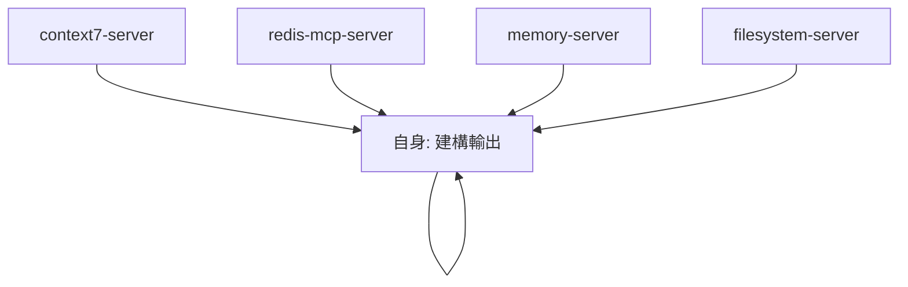
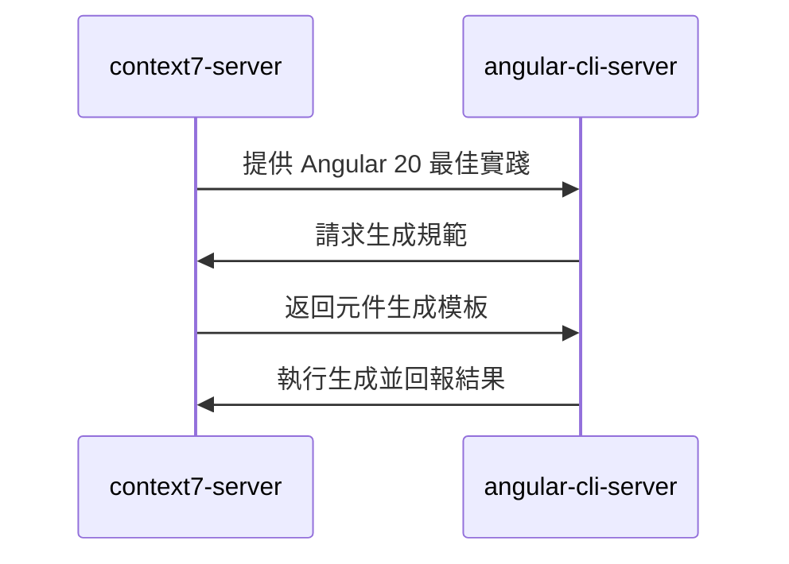
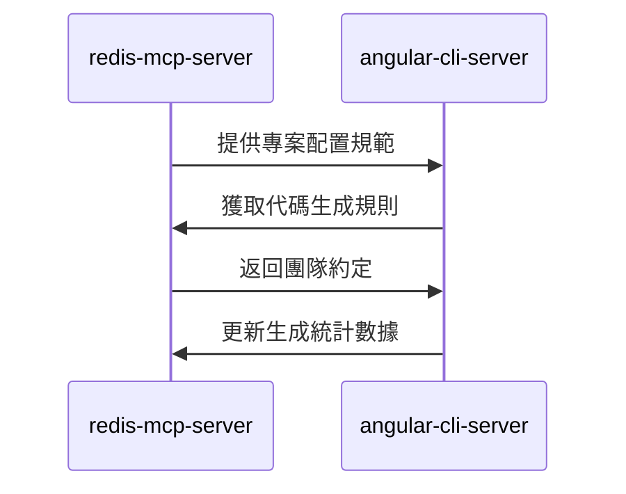
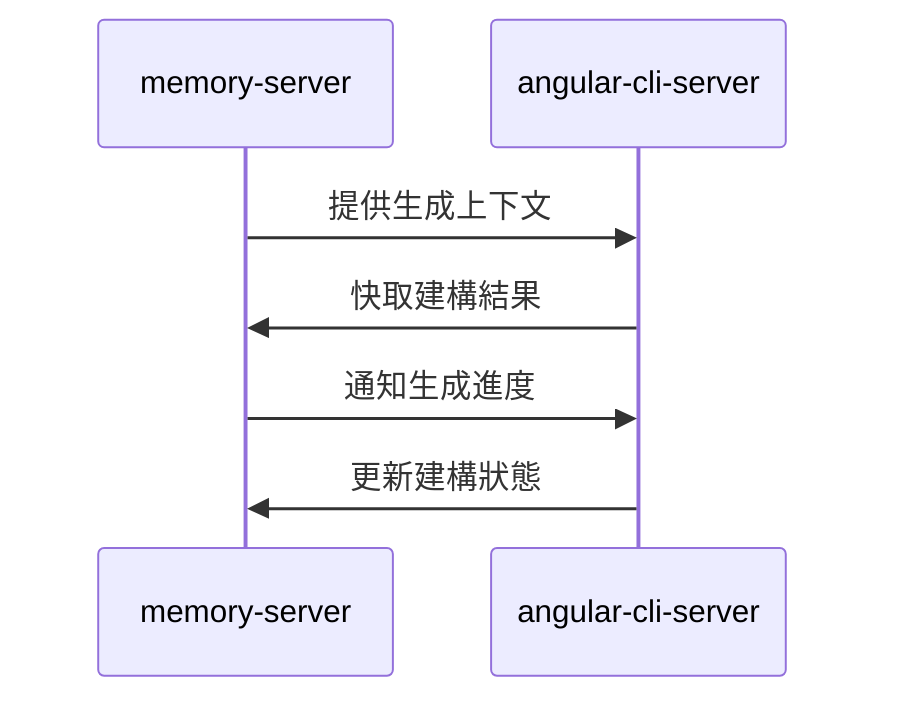
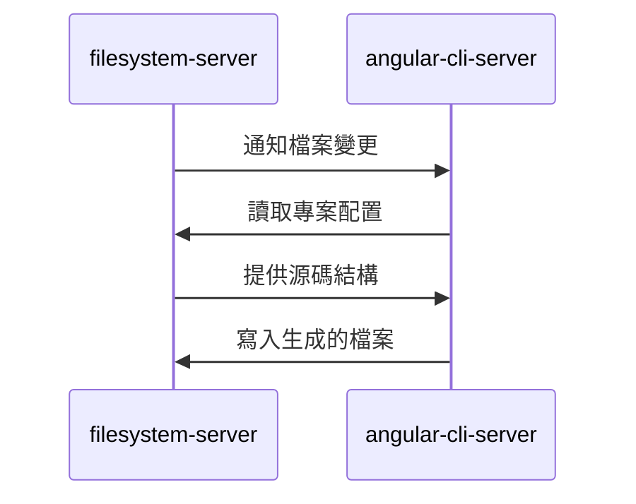

# angular-cli-server (Angular 建構服務器)

> **angular-cli-server 是 MCP 生態系統的 Angular 專案建構與驗證中樞**，負責 CLI 命令執行、代碼生成、建構驗證與即時反饋。
> 
> 遵循 **即時驗證** 原則：每次代碼生成後立即執行建構和測試，確保代碼品質。

---

## 🎯 角色定位 (Role Definition)

### 核心職責
- **代碼生成**: 使用 Angular CLI 生成元件、服務、模組等
- **建構驗證**: 執行建構和測試，驗證生成代碼的正確性
- **專案管理**: 管理 Angular 專案的依賴和配置
- **即時反饋**: 提供熱更新和即時編譯反饋

### 在 MCP 生態中的位置


---

## ⚙️ 配置與啟動 (Configuration & Startup)

### 啟動命令
```bash
npx -y @talzach/mcp-angular-cli
```

### 環境要求
- **Node.js**: >= 18.0.0
- **Angular CLI**: >= 20.0.0
- **npm/yarn**: 最新版本
- **專案根目錄**: 必須包含 angular.json

### 權限配置
```json
{
  "autoApprove": ["*"],
  "description": "完全控制 Angular 專案相關命令，包括生成、建構、測試、部署"
}
```

### 支援的專案類型
- **ng-alain**: 企業級 Angular 管理後台框架
- **Angular Material**: Google 官方 Material Design 元件庫
- **Standalone Components**: Angular 20 獨立元件架構

---

## 🔧 主要功能 (Core Functions)

### 1. 代碼生成 (Code Generation)
```typescript
// 生成 Angular 元件
mcp_angular_cli_ng_generate({
  appRoot: "/path/to/ng-alain",
  schematic: "component",
  name: "user-profile",
  path: "src/app/features/user",
  options: {
    standalone: true,
    changeDetection: "OnPush",
    style: "less",
    skipTests: false
  }
});

// 生成服務
mcp_angular_cli_ng_generate({
  appRoot: "/path/to/ng-alain",
  schematic: "service",
  name: "user-data",
  path: "src/app/core/services",
  options: {
    providedIn: "root"
  }
});

// 生成管道
mcp_angular_cli_ng_generate({
  appRoot: "/path/to/ng-alain",
  schematic: "pipe",
  name: "currency-format",
  path: "src/app/shared/pipes",
  options: {
    standalone: true
  }
});
```

### 2. 套件管理 (Package Management)
```typescript
// 添加 Angular Material
mcp_angular_cli_ng_add({
  appRoot: "/path/to/ng-alain",
  package: "@angular/material",
  options: {
    theme: "indigo-pink",
    typography: true,
    animations: true
  }
});

// 添加 ng-zorro-antd
mcp_angular_cli_ng_add({
  appRoot: "/path/to/ng-alain",
  package: "ng-zorro-antd",
  options: {
    theme: "default",
    locale: "zh_TW"
  }
});

// 添加 PWA 支援
mcp_angular_cli_ng_add({
  appRoot: "/path/to/ng-alain",
  package: "@angular/pwa"
});
```

### 3. 建構與執行 (Build & Run)
```typescript
// 開發建構
mcp_angular_cli_ng_run({
  appRoot: "/path/to/ng-alain",
  target: "app:build",
  options: {
    configuration: "development",
    watch: true
  }
});

// 生產建構
mcp_angular_cli_ng_run({
  appRoot: "/path/to/ng-alain",
  target: "app:build:production",
  options: {
    optimization: true,
    aot: true,
    buildOptimizer: true
  }
});

// 執行測試
mcp_angular_cli_ng_run({
  appRoot: "/path/to/ng-alain",
  target: "app:test",
  options: {
    browsers: "ChromeHeadless",
    watch: false,
    codeCoverage: true
  }
});

// 啟動開發服務器
mcp_angular_cli_ng_run({
  appRoot: "/path/to/ng-alain",
  target: "app:serve",
  options: {
    port: 4200,
    host: "localhost",
    open: true
  }
});
```

### 4. 專案更新 (Project Updates)
```typescript
// 更新 Angular 核心套件
mcp_angular_cli_ng_update({
  appRoot: "/path/to/ng-alain",
  packages: ["@angular/core", "@angular/cli"],
  next: false,
  force: false,
  allowDirty: false
});

// 更新 ng-alain
mcp_angular_cli_ng_update({
  appRoot: "/path/to/ng-alain",
  packages: ["@delon/theme", "ng-alain"],
  createCommits: true,
  verbose: true
});

// 執行遷移
mcp_angular_cli_ng_update({
  appRoot: "/path/to/ng-alain",
  packages: "@angular/core",
  migrateOnly: true,
  from: "19",
  to: "20"
});
```

---

## 🚀 協作模式 (Collaboration Patterns)

### 與 context7-server 協作


### 與 redis-mcp-server 協作


### 與 memory-server 協作


### 與 filesystem-server 協作


---

## 📋 代碼生成最佳實踐 (Code Generation Best Practices)

### Angular 20 生成規範
```typescript
// 元件生成標準配置
const componentDefaults = {
  standalone: true,
  changeDetection: "OnPush",
  style: "less",
  skipTests: false,
  inlineStyle: false,
  inlineTemplate: false,
  viewEncapsulation: "Emulated"
};

// 服務生成標準配置
const serviceDefaults = {
  providedIn: "root",
  skipTests: false
};

// 模組生成標準配置（僅在必要時使用）
const moduleDefaults = {
  routing: true,
  routingScope: "Child"
};
```

### ng-alain 特定配置
```typescript
// ng-alain 元件生成
const ngAlainComponentConfig = {
  path: "src/app/routes",  // ng-alain 路由目錄
  style: "less",           // ng-alain 使用 Less
  prefix: "app",           // 元件前綴
  standalone: true         // Angular 20 獨立元件
};

// ng-alain 頁面生成
const ngAlainPageConfig = {
  path: "src/app/routes/{module}",
  includeRouting: true,
  includeBreadcrumb: true,
  includePageHeader: true
};
```

---

## 🧪 測試與品質保證 (Testing & Quality Assurance)

### 自動化測試流程
```typescript
// 代碼生成後的測試流程
const testingPipeline = {
  unitTests: {
    command: "ng test --no-progress --browsers=ChromeHeadless --code-coverage --no-watch",
    timeout: 300000, // 5 分鐘
    required: true
  },
  linting: {
    command: "ng lint",
    timeout: 60000, // 1 分鐘
    required: true
  },
  buildCheck: {
    command: "ng build --configuration=production",
    timeout: 600000, // 10 分鐘
    required: true
  }
};
```

### 品質檢查點
```typescript
// 代碼品質檢查
const qualityChecks = {
  typescript: "TypeScript 編譯無錯誤",
  eslint: "ESLint 規則通過",
  prettier: "代碼格式化一致",
  tests: "單元測試通過率 > 80%",
  coverage: "代碼覆蓋率 > 70%",
  build: "生產建構成功"
};
```

---

## 📊 效能監控 (Performance Monitoring)

### 建構效能指標
```typescript
// 建構效能監控
const buildMetrics = {
  developmentBuild: "< 30 秒",
  productionBuild: "< 5 分鐘",
  testExecution: "< 2 分鐘",
  linting: "< 30 秒",
  hotReload: "< 3 秒"
};

// 專案規模指標
const projectMetrics = {
  bundleSize: "< 2MB (gzipped)",
  chunkCount: "< 20 chunks",
  treeShaking: "> 90% unused code removed",
  lazyLoading: "所有路由模組延遲載入"
};
```

### 即時監控
```bash
# 監控建構狀態
npm run ng:build-watch

# 監控測試狀態
npm run ng:test-watch

# 監控檔案變更
npm run ng:file-watch

# 效能分析
npm run ng:analyze-bundle
```

---

## 🔍 除錯與故障排除 (Debugging & Troubleshooting)

### 常見問題與解決方案
```typescript
// 常見建構問題
const commonIssues = {
  "TypeScript 編譯錯誤": {
    solution: "檢查 tsconfig.json 配置和型別定義",
    command: "ng build --verbose"
  },
  "模組解析失敗": {
    solution: "檢查 import 路徑和模組匯出",
    command: "ng build --source-map"
  },
  "記憶體不足": {
    solution: "增加 Node.js 記憶體限制",
    command: "node --max-old-space-size=8192 node_modules/@angular/cli/bin/ng build"
  },
  "測試失敗": {
    solution: "檢查測試環境配置和依賴注入",
    command: "ng test --source-map --verbose"
  }
};
```

### 除錯工具
```bash
# 詳細建構日誌
ng build --verbose --progress

# 分析建構產物
ng build --stats-json
npx webpack-bundle-analyzer dist/stats.json

# 測試除錯
ng test --source-map --code-coverage

# 依賴分析
npm ls --depth=0
ng version
```

---

## 📚 使用場景範例 (Usage Scenarios)

### 1. 完整元件生成流程
```typescript
// 完整的元件生成與驗證流程
const generateComponentWorkflow = async () => {
  // 1. 生成元件
  await mcp_angular_cli_ng_generate({
    appRoot: "/path/to/ng-alain",
    schematic: "component",
    name: "user-profile",
    path: "src/app/routes/user",
    options: {
      standalone: true,
      changeDetection: "OnPush",
      style: "less"
    }
  });
  
  // 2. 執行測試驗證
  await mcp_angular_cli_ng_run({
    appRoot: "/path/to/ng-alain",
    target: "app:test",
    options: {
      browsers: "ChromeHeadless",
      watch: false,
      include: "**/user-profile/**"
    }
  });
  
  // 3. 建構驗證
  await mcp_angular_cli_ng_run({
    appRoot: "/path/to/ng-alain",
    target: "app:build",
    options: {
      configuration: "development"
    }
  });
};
```

### 2. 專案升級流程
```typescript
// Angular 專案升級流程
const upgradeProjectWorkflow = async () => {
  // 1. 更新核心套件
  await mcp_angular_cli_ng_update({
    appRoot: "/path/to/ng-alain",
    packages: ["@angular/core", "@angular/cli"],
    allowDirty: true,
    force: false
  });
  
  // 2. 更新 ng-alain
  await mcp_angular_cli_ng_update({
    appRoot: "/path/to/ng-alain",
    packages: ["@delon/theme", "ng-alain"],
    createCommits: true
  });
  
  // 3. 執行完整測試
  await mcp_angular_cli_ng_run({
    appRoot: "/path/to/ng-alain",
    target: "app:test",
    options: {
      browsers: "ChromeHeadless",
      codeCoverage: true
    }
  });
  
  // 4. 生產建構驗證
  await mcp_angular_cli_ng_run({
    appRoot: "/path/to/ng-alain",
    target: "app:build:production"
  });
};
```

### 3. 持續整合流程
```typescript
// CI/CD 整合流程
const cicdWorkflow = async () => {
  // 1. 安裝依賴
  // npm ci (在 CI 環境中執行)
  
  // 2. 代碼檢查
  await mcp_angular_cli_ng_run({
    appRoot: "/path/to/ng-alain",
    target: "app:lint"
  });
  
  // 3. 單元測試
  await mcp_angular_cli_ng_run({
    appRoot: "/path/to/ng-alain",
    target: "app:test",
    options: {
      browsers: "ChromeHeadless",
      watch: false,
      codeCoverage: true
    }
  });
  
  // 4. 生產建構
  await mcp_angular_cli_ng_run({
    appRoot: "/path/to/ng-alain",
    target: "app:build:production"
  });
  
  // 5. E2E 測試
  await mcp_angular_cli_ng_run({
    appRoot: "/path/to/ng-alain",
    target: "app:e2e"
  });
};
```

---

## 📋 使用檢查清單 (Usage Checklist)

### ✅ 代碼生成前
- [ ] 確認專案根目錄包含 angular.json
- [ ] 檢查 Angular CLI 版本相容性
- [ ] 驗證目標路徑存在且可寫入
- [ ] 確認生成選項符合專案規範

### ✅ 代碼生成後
- [ ] 執行單元測試驗證
- [ ] 檢查 TypeScript 編譯無錯誤
- [ ] 驗證 ESLint 規則通過
- [ ] 執行建構確認無問題

### ✅ 套件管理
- [ ] 檢查套件版本相容性
- [ ] 執行安裝後的配置步驟
- [ ] 更新相關的型別定義
- [ ] 測試新功能整合

### ✅ 建構與部署
- [ ] 開發建構成功
- [ ] 生產建構成功
- [ ] 建構產物大小合理
- [ ] 所有測試通過

---

## 🚀 進階功能 (Advanced Features)

### 自定義 Schematic
```typescript
// 創建自定義生成器
const customSchematic = {
  name: "ng-alain-page",
  description: "生成 ng-alain 標準頁面",
  options: {
    name: "頁面名稱",
    module: "所屬模組",
    routing: "是否包含路由",
    breadcrumb: "是否包含麵包屑"
  }
};
```

### 建構最佳化
```typescript
// 建構最佳化配置
const buildOptimization = {
  bundleAnalysis: "分析建構產物大小",
  treeShaking: "移除未使用的代碼",
  codesplitting: "代碼分割策略",
  lazyLoading: "延遲載入優化",
  preloading: "預載入策略"
};
```

### 開發體驗增強
```typescript
// 開發體驗優化
const devExperience = {
  hotModuleReplacement: "熱模組替換",
  sourceMap: "源碼映射",
  errorOverlay: "錯誤覆蓋層",
  liveReload: "即時重載",
  proxyConfig: "API 代理配置"
};
```

---

> **核心原則**: angular-cli-server 確保每次代碼生成都經過嚴格的建構和測試驗證，保證代碼品質。
> 
> **協作理念**: 作為建構驗證的最後一環，整合其他 MCP 服務器的輸出，提供完整的開發體驗。
