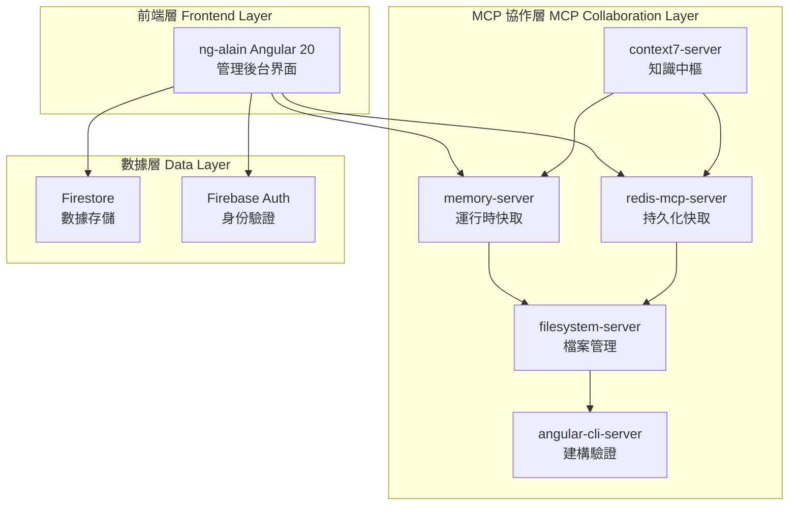

# 專案架構 (Project Architecture)

> **本專案採用 MCP 協作組織架構**，結合 Angular 20 前端與 Firebase 服務，實現高效的代碼生成與管理系統。
>
> 遵循 **極簡主義設計原則**：清晰分層、職責分離、高效協作。

---

## 🏗️ 整體架構 (Overall Architecture)



---

## 📁 主要模組劃分 (Module Structure)

### 前端模組 (Frontend Modules)

```
ng-alain/src/app/
├── core/           # 核心服務、守衛、攔截器
├── shared/         # 共享元件、管道、指令
├── features/       # 功能模組 (用戶、產品、訂單等)
├── layout/         # 佈局元件 (頭部、側邊欄、底部)
└── routes/         # 路由配置與頁面元件
```

### MCP 協作模組 (MCP Collaboration Modules)

- **知識層**: context7-server 提供權威技術文檔查詢
- **快取層**: memory-server + redis-mcp-server 提供多層快取
- **資源層**: filesystem-server 管理專案檔案
- **建構層**: angular-cli-server 執行代碼生成與驗證

---

## 🔄 核心流程 (Core Workflows)

### 代碼生成流程 (Code Generation Flow)

```
用戶需求 → context7 查詢最佳實踐 → redis 獲取專案規範 →
memory 管理生成狀態 → filesystem 讀寫檔案 → angular-cli 建構驗證
```

### 數據流向 (Data Flow)

```
前端界面 → Firebase 服務 (Auth, Firestore) → 數據存儲
     ↓
MCP 協作層 (知識管理、快取、檔案操作)
```

### 權限驗證流程 (Permission Flow)

```
用戶請求 → Firebase Auth 驗證 → 角色權限檢查 → 資源訪問控制
```

---

## 🎯 設計原則 (Design Principles)

### 分支策略與架構一致性 (Branch Strategy and Architectural Consistency)

為確保專案架構的穩定與可維護性，所有功能分支開發應遵循既有模組劃分與架構設計，  
避免無序重構或結構性改變，並作為現有架構的自然擴展。  

> This branch adheres to the original project structure and coding conventions,  
> implementing new features in a way that aligns with the existing modular architecture and style guidelines.
> This ensures that the project remains stable, maintainable, and scalable.

## 基礎框架來源 (Base Framework)

本專案基於 [ng-alain](https://github.com/ng-alain/ng-alain) 企業級 Angular 管理後台框架進行二次開發與擴展。  
為確保與上游框架兼容，分支開發須遵循其目錄結構與設計原則，方便未來升級與維護。

### 極簡主義 (Minimalism)

- **單一職責**: 每個模組只負責一個核心功能
- **最小依賴**: 避免不必要的套件和複雜度
- **清晰介面**: 模組間通過明確的 API 通信

### 分層架構 (Layered Architecture)

- **表現層**: Angular 20 + ng-alain 管理界面
- **數據層**: Firebase 服務提供數據持久化和身份驗證
- **協作層**: MCP 服務器提供開發工具支援

### 可擴展性 (Scalability)

- **水平擴展**: 支援多實例部署
- **垂直擴展**: 支援功能模組獨立擴展
- **模組化設計**: 新功能可獨立開發和部署

---

## 🔧 技術棧 (Technology Stack)

### 前端技術

- **Angular 20**: 主框架，使用 signals 和新控制流
- **ng-alain**: 企業級管理後台框架
- **ng-zorro-antd**: UI 元件庫
- **TypeScript**: 嚴格模式，禁用 any 類型

### 後端技術

- **Firestore**: NoSQL 數據庫
- **Firebase Auth**: 身份驗證服務

### 開發工具

- **MCP 協作系統**: 五個服務器協同工作
- **ESLint + Prettier**: 代碼品質控制
- **Karma + Jasmine**: 單元測試框架

---

> **核心理念**: 通過 MCP 協作組織架構，實現高效的代碼生成與專案管理，確保開發流程的自動化和標準化。
