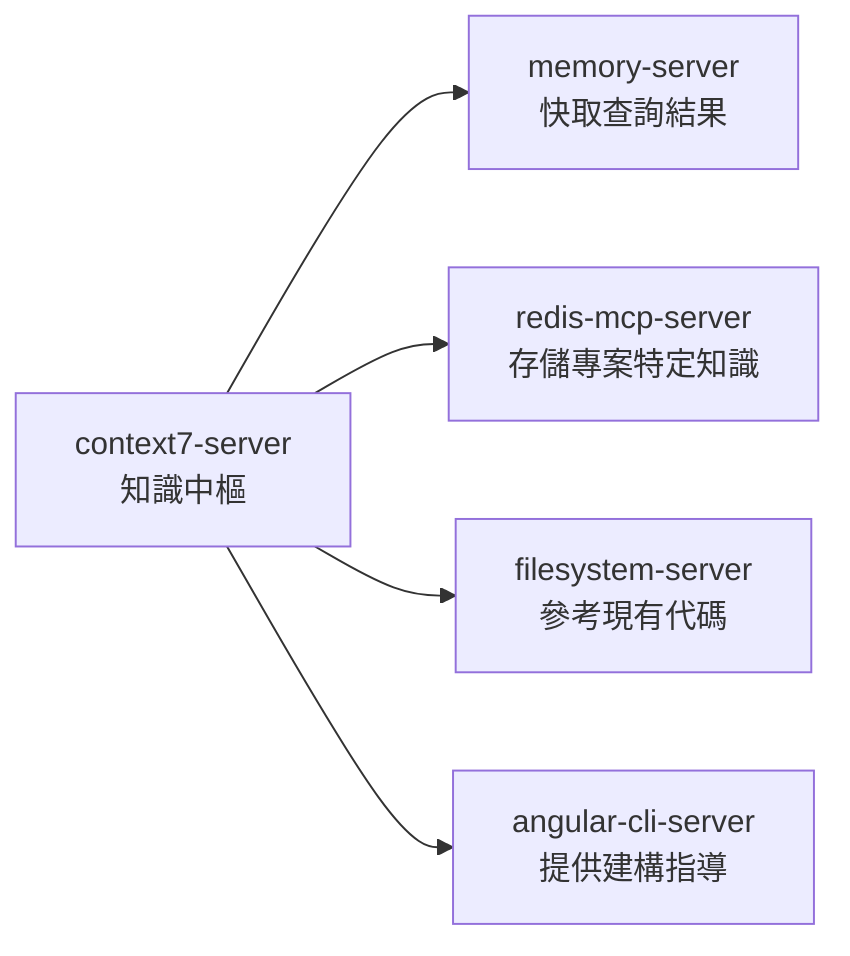
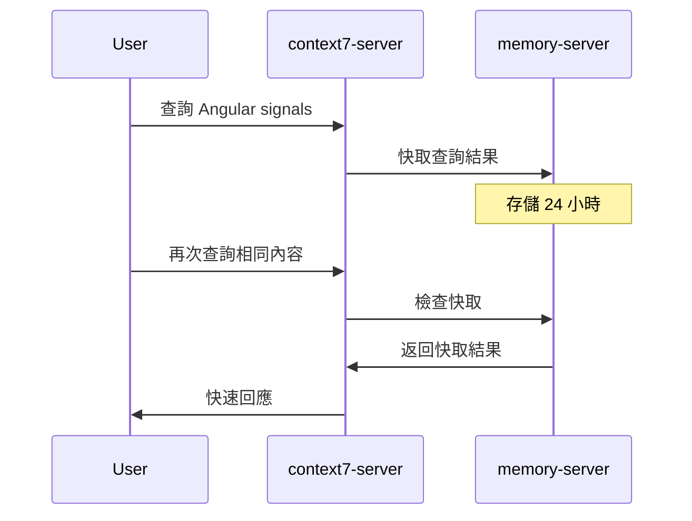
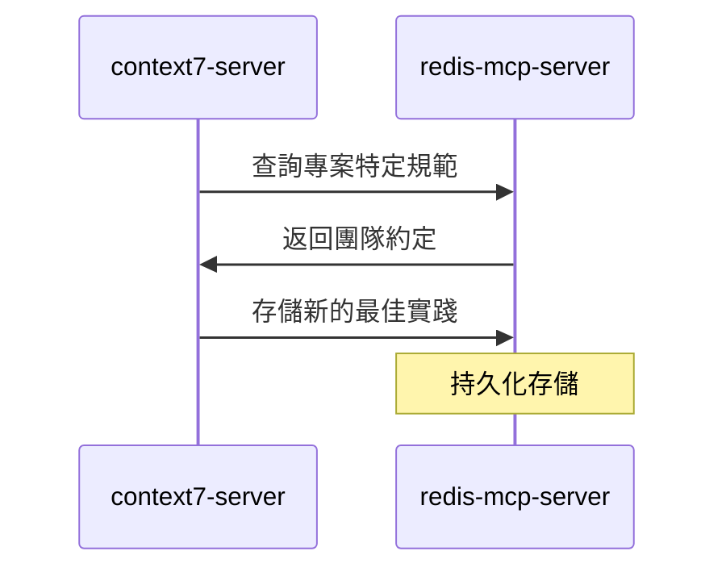
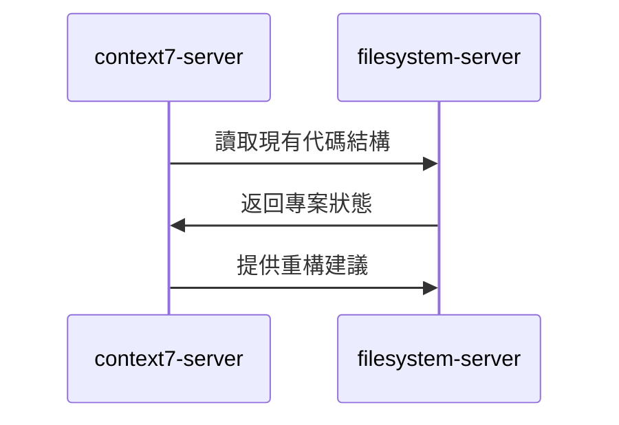
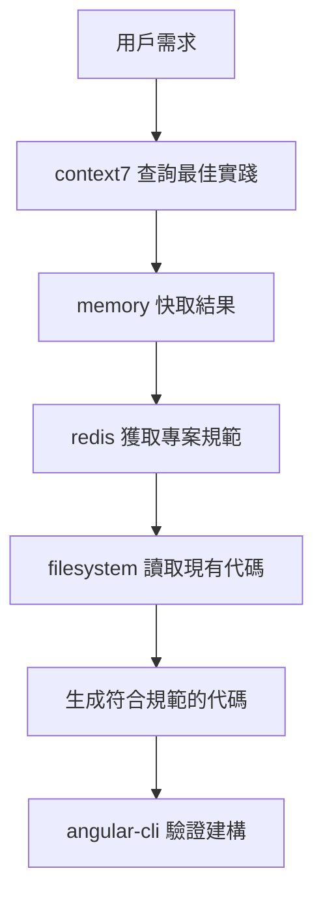

# context7-server (知識中樞服務器)

> **context7-server 是 MCP 生態系統的知識中樞**，提供權威的官方文件查詢與語意檢索服務。
> 
> 遵循 **context7 優先** 原則：任何技術問題都應先透過 context7 尋找權威解法。

---

## 🎯 角色定位 (Role Definition)

### 核心職責
- **權威知識查詢**: 提供 Angular 20、ng-zorro-antd、ng-alain 等官方文件
- **語意檢索**: 支援自然語言查詢，智能匹配相關文件
- **上下文感知**: 根據專案需求提供精準的技術參考
- **知識整合**: 整合多個知識庫，提供全面的技術支援

### 在 MCP 生態中的位置


---

## ⚙️ 配置與啟動 (Configuration & Startup)

### 啟動命令
```bash
npx tsx C:/Users/ac7x/Documents/GitHub/mcp/context7-master/src/index.ts
```

### 環境要求
- **Node.js**: >= 18.0.0
- **TypeScript**: >= 5.0.0
- **網路連接**: 需要存取官方文件庫

### 權限配置
```json
{
  "autoApprove": [
    "resolve-library-id",
    "get-library-docs"
  ]
}
```

---

## 🔧 主要功能 (Core Functions)

### 1. 知識庫解析 (Library Resolution)
```typescript
// 解析知識庫 ID
mcp_context7_resolve_library_id({
  libraryName: "Angular"
});
// 返回: /angular/angular 或 /angular/angular/v20
```

### 2. 文件查詢 (Documentation Query)
```typescript
// 獲取官方文件
mcp_context7_get_library_docs({
  context7CompatibleLibraryID: "/angular/angular/v20",
  topic: "signals",
  tokens: 10000
});
```

### 3. 支援的知識庫 (Supported Libraries)
- **Angular 20**: `/angular/angular/v20`
- **ng-zorro-antd**: `/ng-zorro/ng-zorro-antd`
- **ng-alain**: `/ng-alain/delon`
- **RxJS**: `/reactivex/rxjs`
- **TypeScript**: `/microsoft/typescript`

---

## 🚀 協作模式 (Collaboration Patterns)

### 與 memory-server 協作


### 與 redis-mcp-server 協作


### 與 filesystem-server 協作


---

## 📚 查詢最佳實踐 (Query Best Practices)

### 1. 查詢策略
```typescript
// ✅ 好的查詢方式
"Angular 20 signals 狀態管理最佳實踐"
"ng-zorro-antd table 大數據渲染優化"
"Angular @if/@for 控制流語法範例"

// ❌ 避免的查詢方式  
"Angular"  // 太泛泛
"如何寫代碼"  // 不具體
"bug修復"  // 缺乏上下文
```

### 2. 主題聚焦
```typescript
// 使用 topic 參數聚焦查詢
mcp_context7_get_library_docs({
  context7CompatibleLibraryID: "/angular/angular/v20",
  topic: "signals",  // 聚焦於 signals
  tokens: 5000
});
```

### 3. 令牌管理
```typescript
// 根據需求調整令牌數量
const tokenStrategy = {
  quickReference: 2000,    // 快速參考
  detailedGuide: 10000,    // 詳細指南
  comprehensiveDoc: 20000  // 全面文件
};
```

---

## 🎯 代碼生成整合 (Code Generation Integration)

### 標準工作流程


### 實際範例
```typescript
// 1. 查詢 Angular 20 元件最佳實踐
const bestPractices = await mcp_context7_get_library_docs({
  context7CompatibleLibraryID: "/angular/angular/v20",
  topic: "component architecture signals",
  tokens: 8000
});

// 2. 結合專案規範生成代碼
// 3. 使用 filesystem 寫入檔案
// 4. 透過 angular-cli 驗證
```

---

## 🔍 監控與除錯 (Monitoring & Debugging)

### 關鍵指標
- **查詢響應時間**: < 2 秒
- **快取命中率**: > 80%
- **知識庫覆蓋率**: > 95%
- **查詢成功率**: > 99%

### 常見問題排除
```bash
# 檢查 context7 服務狀態
curl -X GET http://localhost:3000/health

# 查看查詢日誌
tail -f context7.log

# 測試知識庫連接
npm run context7:test-connection
```

---

## 📋 使用檢查清單 (Usage Checklist)

### ✅ 查詢前準備
- [ ] 確認查詢目標明確
- [ ] 選擇正確的知識庫 ID
- [ ] 設定適當的令牌數量
- [ ] 檢查 memory 快取狀態

### ✅ 查詢執行
- [ ] 使用具體的技術關鍵字
- [ ] 包含版本資訊 (如 Angular 20)
- [ ] 指定相關主題範圍
- [ ] 驗證查詢結果的權威性

### ✅ 結果處理
- [ ] 將重要結果快取到 memory
- [ ] 專案特定知識存入 redis
- [ ] 整合到代碼生成流程
- [ ] 更新團隊知識庫

---

## 🚀 進階功能 (Advanced Features)

### 多知識庫整合查詢
```typescript
// 同時查詢多個相關知識庫
const angularDocs = await mcp_context7_get_library_docs({
  context7CompatibleLibraryID: "/angular/angular/v20",
  topic: "signals"
});

const ngZorroDocs = await mcp_context7_get_library_docs({
  context7CompatibleLibraryID: "/ng-zorro/ng-zorro-antd",
  topic: "table signals integration"
});
```

### 智能查詢建議
```typescript
// 基於專案上下文的智能查詢
const contextAwareQuery = {
  project: "ng-alain",
  version: "20",
  feature: "user-management",
  focus: "signals + table + form"
};
```

---

> **核心原則**: context7-server 是權威知識的唯一來源，所有技術決策都應以其查詢結果為準。
> 
> **協作理念**: 知識驅動代碼生成，確保生成的代碼符合最新的官方最佳實踐。

# context7 使用指南

> 本文件詳細說明 `context7` 的使用方法與最佳實踐。
> 關於它在專案知識管理中的整體定位與 `mcp-redis` 的協作關係，請參考 **[`@project-knowledge-rules.md`](./project-knowledge-rules.md)**。

---

## 1. 什麼是 context7？
`context7` 是 AI 驅動的知識查詢系統，能即時查詢 Angular 20 官方文件、API、最佳實踐，並支援語意搜尋。它是我們團隊解決技術問題、獲取權威資訊的**首選工具**。

## 2. 主要用途
- 查詢 Angular 20 官方 API（如 signals、@if/@for、Zoneless）。
- 搜尋最新、最權威的 Angular 最佳實踐與反模式。
- 輔助程式碼生成、技術方案設計與程式碼審查。

## 3. 查詢範例
- "Angular signals 狀態管理最佳實踐"
- "Angular @for 控制流搭配 track 使用範例"
- "Angular 20 官方認證的反模式有哪些"
- "Angular Material 響應式設計的斷點系統"

---
> **核心原則：任何公開的、普遍性的技術問題，都應先透過 `context7` 尋求解法。**
