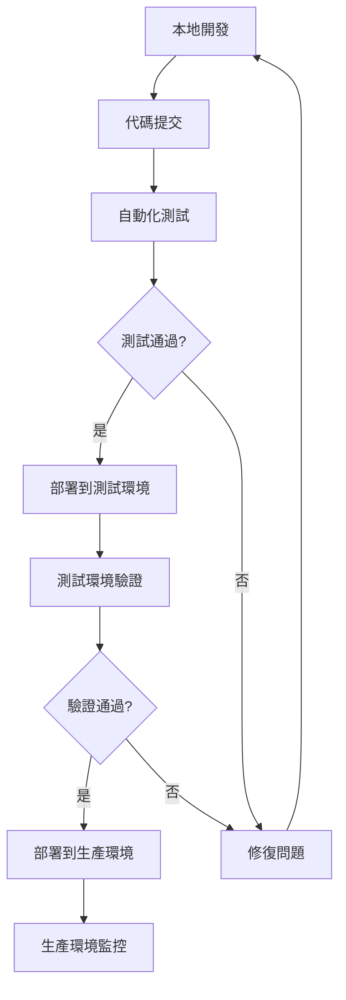

# 部署指南 (Deployment Guide)

> **本專案採用 Firebase 全棧部署方案**，支援前端 Angular 應用與後端 Functions 的統一部署管理。
> 
> 部署策略：**本地開發 → 測試環境 → 生產環境**，確保代碼品質與穩定性。

---

## 🚀 部署流程 (Deployment Workflow)

### 標準部署流程


---

## 🛠️ 環境需求 (Environment Requirements)

### 必要工具
```bash
# Node.js (>= 18.0.0)
node --version

# Angular CLI (>= 20.0.0)
ng version

# Firebase CLI
npm install -g firebase-tools
firebase --version

# Git
git --version
```

### 環境變數設定
```bash
# .env.local (本地開發)
FIREBASE_PROJECT_ID=your-project-dev
FIREBASE_API_KEY=your-api-key-dev
ANGULAR_ENV=development

# .env.staging (測試環境)
FIREBASE_PROJECT_ID=your-project-staging
FIREBASE_API_KEY=your-api-key-staging
ANGULAR_ENV=staging

# .env.production (生產環境)
FIREBASE_PROJECT_ID=your-project-prod
FIREBASE_API_KEY=your-api-key-prod
ANGULAR_ENV=production
```

---

## 📋 部署步驟 (Deployment Steps)

### 1. 本地開發環境
```bash
# 安裝依賴
npm install

# 啟動開發服務器
ng serve

# 啟動 Firebase Functions 模擬器
cd functions
npm run serve

# 啟動 Firestore 模擬器
firebase emulators:start
```

### 2. 測試環境部署
```bash
# 建構前端應用
ng build --configuration=staging

# 執行測試
npm run test:ci
npm run e2e:ci

# 部署到測試環境
firebase use staging
firebase deploy --only hosting,functions
```

### 3. 生產環境部署
```bash
# 建構生產版本
ng build --configuration=production

# 執行完整測試套件
npm run test:full
npm run lint
npm run e2e:full

# 部署到生產環境
firebase use production
firebase deploy --only hosting,functions

# 部署 Firestore 規則和索引
firebase deploy --only firestore:rules,firestore:indexes
```

---

## 🔧 主要部署指令 (Key Deployment Commands)

### Angular 建構指令
```bash
# 開發建構
ng build

# 測試環境建構
ng build --configuration=staging

# 生產環境建構
ng build --configuration=production --aot --build-optimizer

# 分析建構產物
ng build --stats-json
npx webpack-bundle-analyzer dist/stats.json
```

### Firebase 部署指令
```bash
# 完整部署
firebase deploy

# 僅部署前端
firebase deploy --only hosting

# 僅部署 Functions
firebase deploy --only functions

# 僅部署特定 Function
firebase deploy --only functions:functionName

# 部署 Firestore 規則
firebase deploy --only firestore:rules

# 部署 Firestore 索引
firebase deploy --only firestore:indexes
```

### 環境管理指令
```bash
# 查看可用專案
firebase projects:list

# 切換專案
firebase use project-id

# 設定預設專案
firebase use --add

# 查看當前專案
firebase use
```

---

## 🔍 部署驗證 (Deployment Verification)

### 自動化檢查
```bash
# 健康檢查腳本
#!/bin/bash
echo "開始部署後驗證..."

# 檢查前端應用
curl -f https://your-app.web.app/health || exit 1

# 檢查 API 端點
curl -f https://your-region-your-project.cloudfunctions.net/api/health || exit 1

# 檢查 Firestore 連接
firebase firestore:databases:list

echo "部署驗證完成！"
```

### 手動驗證清單
```markdown
### ✅ 前端驗證
- [ ] 應用正常載入
- [ ] 路由功能正常
- [ ] API 調用成功
- [ ] 用戶認證功能正常

### ✅ 後端驗證
- [ ] Functions 正常響應
- [ ] 數據庫讀寫正常
- [ ] 權限控制生效
- [ ] 日誌記錄正常

### ✅ 效能驗證
- [ ] 頁面載入時間 < 3 秒
- [ ] API 響應時間 < 1 秒
- [ ] 建構產物大小合理
- [ ] 無 JavaScript 錯誤
```

---

## 🚨 常見部署問題 (Common Deployment Issues)

### 建構問題
```bash
# 問題：TypeScript 編譯錯誤
# 解決方案：
ng build --verbose  # 查看詳細錯誤
npm run lint        # 檢查代碼規範

# 問題：記憶體不足
# 解決方案：
node --max-old-space-size=8192 node_modules/@angular/cli/bin/ng build

# 問題：依賴版本衝突
# 解決方案：
npm ci              # 清潔安裝
npm audit fix       # 修復安全漏洞
```

### Firebase 部署問題
```bash
# 問題：權限不足
# 解決方案：
firebase login      # 重新登入
firebase use --add  # 重新設定專案

# 問題：Functions 部署失敗
# 解決方案：
cd functions
npm run build       # 檢查 Functions 建構
firebase deploy --only functions --debug

# 問題：Hosting 部署失敗
# 解決方案：
firebase hosting:disable  # 停用舊版本
firebase deploy --only hosting
```

### 環境配置問題
```bash
# 問題：環境變數未載入
# 解決方案：
# 檢查 .env 檔案位置和格式
# 確認 angular.json 中的 fileReplacements 配置

# 問題：API 端點錯誤
# 解決方案：
# 檢查 environment.ts 中的 API URL
# 確認 Firebase 專案 ID 正確
```

---

## 📊 部署監控 (Deployment Monitoring)

### 效能監控
```typescript
// 前端效能監控
import { getAnalytics, logEvent } from 'firebase/analytics';

const analytics = getAnalytics();

// 記錄頁面載入時間
logEvent(analytics, 'page_load_time', {
  page: window.location.pathname,
  load_time: performance.now()
});

// 記錄 API 調用時間
logEvent(analytics, 'api_call_time', {
  endpoint: '/api/users',
  response_time: responseTime
});
```

### 錯誤監控
```typescript
// 全域錯誤處理
window.addEventListener('error', (event) => {
  console.error('Global error:', event.error);
  
  // 發送錯誤到監控服務
  logEvent(analytics, 'javascript_error', {
    error_message: event.error.message,
    error_stack: event.error.stack,
    page: window.location.pathname
  });
});
```

---

## 🔄 CI/CD 整合 (CI/CD Integration)

### GitHub Actions 範例
```yaml
# .github/workflows/deploy.yml
name: Deploy to Firebase

on:
  push:
    branches: [ main ]

jobs:
  deploy:
    runs-on: ubuntu-latest
    
    steps:
    - uses: actions/checkout@v3
    
    - name: Setup Node.js
      uses: actions/setup-node@v3
      with:
        node-version: '18'
        cache: 'npm'
    
    - name: Install dependencies
      run: npm ci
    
    - name: Run tests
      run: npm run test:ci
    
    - name: Build application
      run: ng build --configuration=production
    
    - name: Deploy to Firebase
      uses: FirebaseExtended/action-hosting-deploy@v0
      with:
        repoToken: '${{ secrets.GITHUB_TOKEN }}'
        firebaseServiceAccount: '${{ secrets.FIREBASE_SERVICE_ACCOUNT }}'
        projectId: your-project-id
```

---

## 📋 部署檢查清單 (Deployment Checklist)

### ✅ 部署前檢查
- [ ] 代碼已提交到版本控制
- [ ] 所有測試通過
- [ ] 建構無錯誤
- [ ] 環境變數配置正確
- [ ] 依賴版本相容

### ✅ 部署中檢查
- [ ] 選擇正確的 Firebase 專案
- [ ] 使用正確的建構配置
- [ ] 監控部署進度
- [ ] 檢查部署日誌

### ✅ 部署後檢查
- [ ] 應用正常運行
- [ ] 功能測試通過
- [ ] 效能指標正常
- [ ] 錯誤監控啟用
- [ ] 備份和回滾計劃就緒

---

> **核心理念**: 通過自動化部署流程和嚴格的驗證機制，確保每次部署都是安全、可靠和可回滾的。
> 
> **持續改進**: 定期檢視部署流程，優化建構時間和部署效率。
