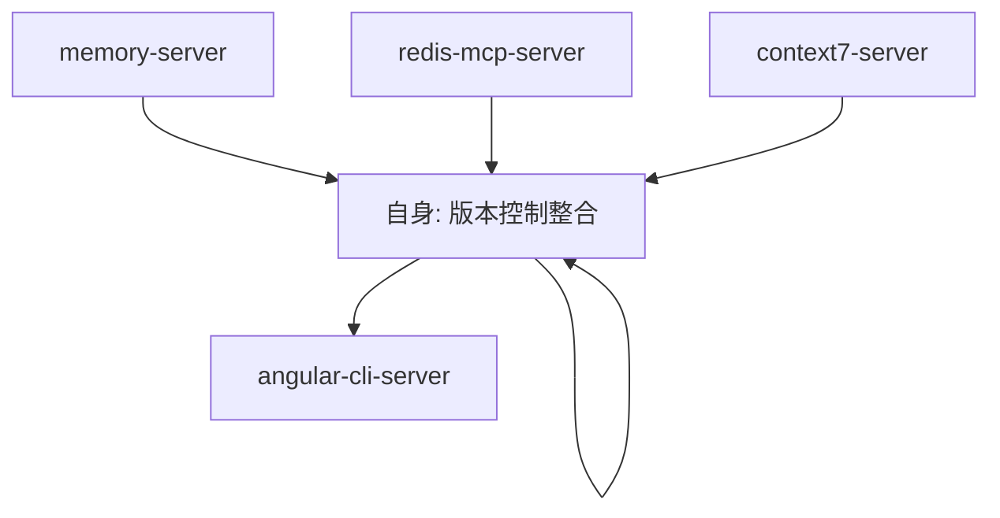
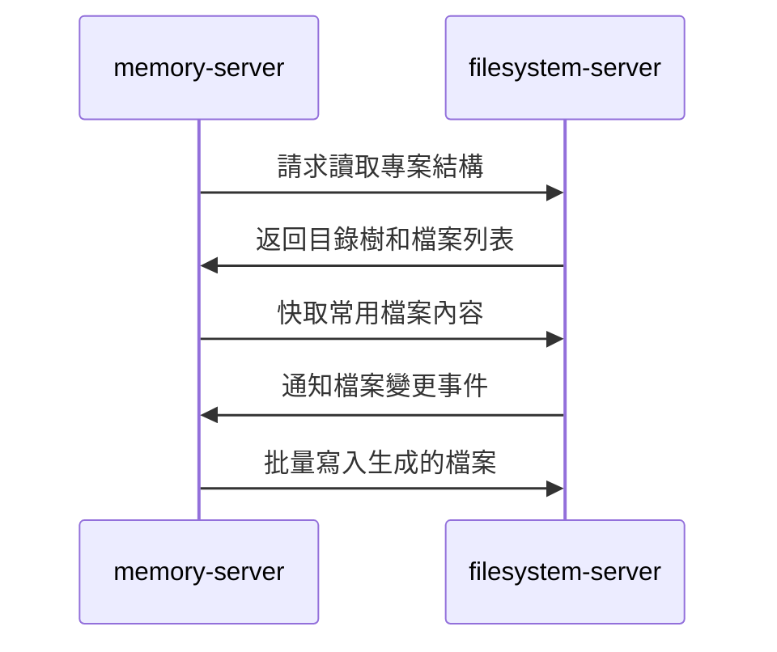
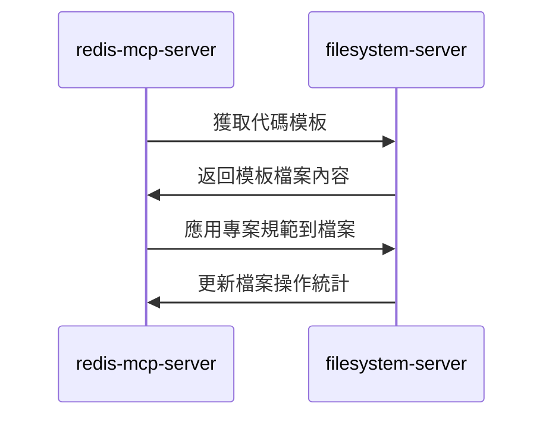
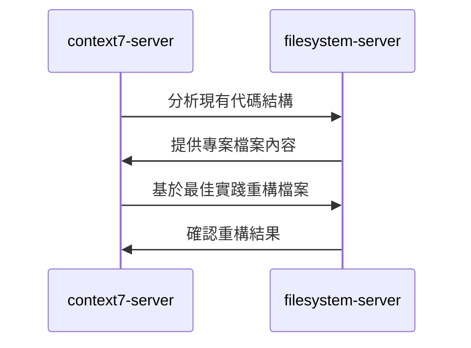
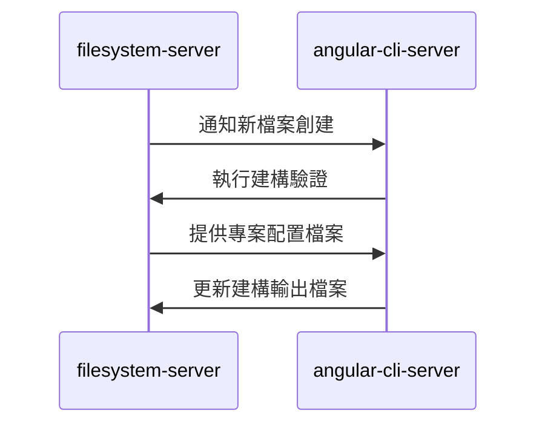

# filesystem-server (檔案系統管理服務器)

> **filesystem-server 是 MCP 生態系統的檔案系統管理中樞**，負責源碼檔案、專案資源的安全讀寫與目錄管理。
> 
> 遵循 **安全第一** 原則：限定操作範圍，確保檔案操作的安全性和可控性。

---

## 🎯 角色定位 (Role Definition)

### 核心職責
- **源碼管理**: 讀寫 Angular 專案源碼檔案
- **資源管理**: 管理專案模板、配置檔案、靜態資源
- **目錄結構維護**: 創建和維護專案目錄結構
- **檔案安全**: 限定操作範圍，防止誤操作系統檔案

### 在 MCP 生態中的位置


---

## ⚙️ 配置與啟動 (Configuration & Startup)

### 啟動命令
```bash
npx -y @modelcontextprotocol/server-filesystem ./ng-alain/src ./functions
```

### 允許的目錄範圍
- **./ng-alain/src**: Angular 前端專案源碼
- **./functions**: Firebase Functions 後端代碼

### 環境要求
- **Node.js**: >= 18.0.0
- **檔案系統權限**: 讀寫指定目錄的權限
- **版本控制**: 建議整合 Git

### 權限配置
```json
{
  "autoApprove": [
    "read_file", "read_multiple_files", "write_file", "edit_file",
    "create_directory", "list_directory", "list_directory_with_sizes",
    "directory_tree", "move_file", "search_files", "get_file_info"
  ],
  "allowedDirectories": ["./ng-alain/src", "./functions"]
}
```

---

## 📁 主要功能 (Core Functions)

### 1. 檔案讀取 (File Reading)
```typescript
// 讀取單個檔案
mcp_filesystem_read_file({
  path: "ng-alain/src/app/core/services/auth.service.ts"
});

// 讀取多個檔案
mcp_filesystem_read_multiple_files({
  paths: [
    "ng-alain/src/app/shared/models/user.model.ts",
    "ng-alain/src/app/features/user/user.component.ts"
  ]
});

// 讀取檔案前幾行或後幾行
mcp_filesystem_read_file({
  path: "ng-alain/src/app/app.component.ts",
  head: 20  // 前 20 行
});
```

### 2. 檔案寫入與編輯 (File Writing & Editing)
```typescript
// 創建新檔案
mcp_filesystem_write_file({
  path: "ng-alain/src/app/shared/models/product.model.ts",
  content: `export interface Product {
  id: string;
  name: string;
  price: number;
  category: string;
}`
});

// 編輯現有檔案
mcp_filesystem_edit_file({
  path: "ng-alain/src/app/shared/models/user.model.ts",
  edits: [
    {
      oldText: "export interface User {\n  id: string;\n  name: string;\n}",
      newText: "export interface User {\n  id: string;\n  name: string;\n  email: string;\n  role: UserRole;\n}"
    }
  ]
});

// 預覽編輯效果
mcp_filesystem_edit_file({
  path: "ng-alain/src/app/shared/models/user.model.ts",
  dryRun: true,
  edits: [/* 編輯內容 */]
});
```

### 3. 目錄管理 (Directory Management)
```typescript
// 創建目錄
mcp_filesystem_create_directory({
  path: "ng-alain/src/app/features/reports"
});

// 列出目錄內容
mcp_filesystem_list_directory({
  path: "ng-alain/src/app/features"
});

// 列出目錄內容（含檔案大小）
mcp_filesystem_list_directory_with_sizes({
  path: "ng-alain/src/app/core",
  sortBy: "size"
});

// 獲取目錄樹結構
mcp_filesystem_directory_tree({
  path: "ng-alain/src/app/shared"
});
```

### 4. 檔案搜尋與資訊 (File Search & Info)
```typescript
// 搜尋檔案
mcp_filesystem_search_files({
  path: "ng-alain/src/app",
  pattern: "*.component.ts",
  excludePatterns: ["*.spec.ts", "node_modules/**"]
});

// 獲取檔案資訊
mcp_filesystem_get_file_info({
  path: "ng-alain/src/app/app.component.ts"
});

// 移動/重命名檔案
mcp_filesystem_move_file({
  source: "ng-alain/src/app/old-component.ts",
  destination: "ng-alain/src/app/new-component.ts"
});
```

---

## 🚀 協作模式 (Collaboration Patterns)

### 與 memory-server 協作


### 與 redis-mcp-server 協作


### 與 context7-server 協作


### 與 angular-cli-server 協作


---

## 📂 專案結構管理 (Project Structure Management)

### Angular 專案標準結構
```typescript
// ng-alain 專案結構
const ngAlainStructure = {
  "src/app": {
    "core": ["services", "guards", "interceptors", "models"],
    "shared": ["components", "directives", "pipes", "models"],
    "features": ["user", "product", "order", "report"],
    "layout": ["header", "sidebar", "footer"],
    "routes": ["routing modules"]
  }
};

// Firebase Functions 結構
const functionsStructure = {
  "src": {
    "api": ["user", "product", "order"],
    "services": ["auth", "database", "storage"],
    "utils": ["helpers", "validators", "constants"],
    "types": ["interfaces", "enums"]
  }
};
```

### 檔案命名規範
```typescript
// Angular 檔案命名規範
const namingConventions = {
  component: "user-profile.component.ts",
  service: "user.service.ts",
  model: "user.model.ts",
  interface: "user.interface.ts",
  enum: "user-role.enum.ts",
  pipe: "currency-format.pipe.ts",
  directive: "highlight.directive.ts",
  guard: "auth.guard.ts",
  interceptor: "auth.interceptor.ts"
};
```

---

## 🔒 安全性與權限控制 (Security & Access Control)

### 目錄限制
```typescript
// 允許的操作目錄
const allowedDirectories = [
  "./ng-alain/src",     // Angular 前端源碼
  "./functions"         // Firebase Functions 後端
];

// 禁止的操作
const forbiddenOperations = [
  "訪問系統目錄",
  "修改配置檔案 (angular.json, package.json)",
  "刪除重要檔案",
  "訪問 node_modules"
];
```

### 檔案操作驗證
```typescript
// 檔案操作前驗證
const fileOperationValidation = {
  beforeRead: "檢查檔案是否存在且可讀",
  beforeWrite: "驗證目標目錄權限",
  beforeEdit: "備份原始檔案",
  beforeDelete: "確認檔案不是關鍵檔案"
};
```

---

## 📊 檔案操作統計 (File Operation Statistics)

### 操作類型統計
```typescript
// 檔案操作統計
interface FileOperationStats {
  reads: {
    total: number;
    byFileType: Record<string, number>;
    averageSize: number;
  };
  writes: {
    total: number;
    newFiles: number;
    modifications: number;
  };
  directories: {
    created: number;
    scanned: number;
  };
  searches: {
    total: number;
    averageResults: number;
  };
}
```

### 效能監控
```typescript
// 效能指標
const performanceMetrics = {
  readSpeed: "> 100 files/second",
  writeSpeed: "> 50 files/second",
  searchSpeed: "< 1 second for 1000 files",
  memoryUsage: "< 256MB",
  diskUsage: "監控專案大小變化"
};
```

---

## 🔍 監控與除錯 (Monitoring & Debugging)

### 檔案操作日誌
```bash
# 查看檔案操作日誌
npm run filesystem:logs

# 監控檔案變更
npm run filesystem:watch

# 檢查檔案完整性
npm run filesystem:integrity-check

# 清理臨時檔案
npm run filesystem:cleanup
```

### 常見問題排除
```typescript
// 常見問題與解決方案
const troubleshooting = {
  "檔案讀取失敗": "檢查檔案路徑和權限",
  "寫入權限不足": "確認目錄寫入權限",
  "檔案鎖定": "檢查是否有其他程序佔用",
  "路徑不存在": "自動創建必要的目錄結構"
};
```

---

## 📚 使用場景範例 (Usage Scenarios)

### 1. 代碼生成場景
```typescript
// 生成新的 Angular 元件
const generateComponent = async () => {
  // 1. 創建目錄結構
  await mcp_filesystem_create_directory({
    path: "ng-alain/src/app/features/user-profile"
  });
  
  // 2. 生成元件檔案
  await mcp_filesystem_write_file({
    path: "ng-alain/src/app/features/user-profile/user-profile.component.ts",
    content: componentTemplate
  });
  
  // 3. 生成模板檔案
  await mcp_filesystem_write_file({
    path: "ng-alain/src/app/features/user-profile/user-profile.component.html",
    content: htmlTemplate
  });
  
  // 4. 生成樣式檔案
  await mcp_filesystem_write_file({
    path: "ng-alain/src/app/features/user-profile/user-profile.component.less",
    content: styleTemplate
  });
};
```

### 2. 專案重構場景
```typescript
// 重構專案結構
const refactorProject = async () => {
  // 1. 分析現有結構
  const currentStructure = await mcp_filesystem_directory_tree({
    path: "ng-alain/src/app"
  });
  
  // 2. 搜尋需要重構的檔案
  const componentsToRefactor = await mcp_filesystem_search_files({
    path: "ng-alain/src/app",
    pattern: "*.component.ts"
  });
  
  // 3. 批量編輯檔案
  for (const file of componentsToRefactor) {
    await mcp_filesystem_edit_file({
      path: file,
      edits: refactoringEdits
    });
  }
};
```

### 3. 模板管理場景
```typescript
// 管理代碼模板
const manageTemplates = async () => {
  // 1. 讀取現有模板
  const templates = await mcp_filesystem_read_multiple_files({
    paths: [
      "templates/component.template.ts",
      "templates/service.template.ts",
      "templates/model.template.ts"
    ]
  });
  
  // 2. 基於模板生成代碼
  const generatedCode = processTemplate(templates.component, {
    name: "UserProfile",
    properties: ["id", "name", "email"]
  });
  
  // 3. 寫入生成的代碼
  await mcp_filesystem_write_file({
    path: "ng-alain/src/app/models/user-profile.model.ts",
    content: generatedCode
  });
};
```

---

## 📋 使用檢查清單 (Usage Checklist)

### ✅ 檔案操作前
- [ ] 確認操作路徑在允許範圍內
- [ ] 檢查檔案/目錄是否存在
- [ ] 驗證操作權限
- [ ] 備份重要檔案（如需要）

### ✅ 檔案讀取
- [ ] 使用適當的讀取方法（單檔案 vs 多檔案）
- [ ] 考慮檔案大小和效能
- [ ] 處理讀取錯誤
- [ ] 快取常用檔案內容

### ✅ 檔案寫入
- [ ] 驗證檔案內容格式
- [ ] 確保目錄結構存在
- [ ] 處理檔案衝突
- [ ] 記錄操作日誌

### ✅ 目錄管理
- [ ] 遵循專案結構規範
- [ ] 使用標準命名約定
- [ ] 定期清理無用檔案
- [ ] 監控目錄大小變化

---

## 🚀 進階功能 (Advanced Features)

### 版本控制整合
```typescript
// Git 整合功能
const gitIntegration = {
  autoCommit: "自動提交生成的代碼",
  branchManagement: "為代碼生成創建分支",
  conflictResolution: "處理合併衝突",
  changeTracking: "追蹤檔案變更"
};
```

### 檔案監控
```typescript
// 檔案變更監控
const fileWatcher = {
  realTimeMonitoring: "即時監控檔案變更",
  changeNotification: "通知其他 MCP 服務器",
  autoReload: "自動重載變更的檔案",
  conflictDetection: "檢測並發修改衝突"
};
```

### 智能檔案管理
```typescript
// 智能檔案操作
const smartFileManagement = {
  duplicateDetection: "檢測重複檔案",
  unusedFileCleanup: "清理未使用的檔案",
  dependencyAnalysis: "分析檔案依賴關係",
  optimizationSuggestions: "提供檔案結構優化建議"
};
```

---

> **核心原則**: filesystem-server 確保檔案操作的安全性和可控性，為代碼生成提供可靠的檔案系統基礎。
> 
> **協作理念**: 作為檔案系統的統一介面，協調其他 MCP 服務器的檔案操作需求，維護專案結構的一致性。
