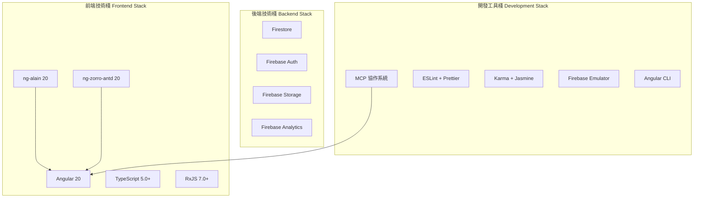

# 技術框架 (Technology Frameworks)

> **本專案採用現代化全棧技術架構**，結合 Angular 20 前端框架與 Firebase 後端服務，實現高效的企業級應用開發。
> 
> 技術選型原則：**穩定性、效能、開發效率、社群支援**。

---

## 🎯 技術棧總覽 (Technology Stack Overview)



---

## 🚀 前端框架 (Frontend Frameworks)

### Angular 20
```json
{
  "version": "20.0.0",
  "purpose": "主要前端框架",
  "keyFeatures": [
    "Signals 狀態管理",
    "新控制流 (@if/@for/@switch)",
    "Standalone Components",
    "OnPush 變更檢測",
    "Zoneless Change Detection"
  ],
  "advantages": [
    "企業級框架穩定性",
    "強型別 TypeScript 支援",
    "豐富的生態系統",
    "優秀的開發工具"
  ]
}
```

### ng-alain 20
```json
{
  "version": "20.0.0",
  "purpose": "企業級管理後台框架",
  "keyFeatures": [
    "完整的後台管理模板",
    "豐富的業務元件",
    "多語言支援",
    "主題定制系統",
    "權限管理系統"
  ],
  "advantages": [
    "開箱即用的管理界面",
    "豐富的頁面模板",
    "完善的權限控制",
    "活躍的社群支援"
  ]
}
```

### ng-zorro-antd 20
```json
{
  "version": "20.0.0",
  "purpose": "企業級 UI 元件庫",
  "keyFeatures": [
    "豐富的 UI 元件",
    "Ant Design 設計語言",
    "國際化支援",
    "主題定制",
    "無障礙功能"
  ],
  "advantages": [
    "設計一致性",
    "元件品質高",
    "文檔完善",
    "持續更新"
  ]
}
```

### TypeScript 5.0+
```json
{
  "version": "5.0+",
  "purpose": "靜態型別檢查",
  "keyFeatures": [
    "嚴格模式",
    "型別推斷",
    "介面定義",
    "泛型支援",
    "裝飾器"
  ],
  "advantages": [
    "編譯時錯誤檢查",
    "更好的 IDE 支援",
    "代碼可維護性",
    "重構安全性"
  ]
}
```

---

## 🔧 後端框架 (Backend Frameworks)


### Firestore
```json
{
  "version": "Latest",
  "purpose": "NoSQL 文檔數據庫",
  "keyFeatures": [
    "即時同步",
    "離線支援",
    "安全規則",
    "自動擴展",
    "多區域複製"
  ],
  "advantages": [
    "即時數據同步",
    "強大的查詢功能",
    "安全性控制",
    "高可用性"
  ]
}
```

### Firebase Auth
```json
{
  "version": "Latest",
  "purpose": "身份認證服務",
  "keyFeatures": [
    "多種登入方式",
    "JWT Token",
    "用戶管理",
    "安全規則整合",
    "多因素認證"
  ],
  "advantages": [
    "安全可靠",
    "易於整合",
    "多平台支援",
    "豐富的認證選項"
  ]
}
```

---

## 🛠️ 開發工具框架 (Development Tools)

### MCP 協作系統
```json
{
  "version": "Custom",
  "purpose": "代碼生成與協作",
  "components": [
    "context7-server (知識中樞)",
    "memory-server (運行時快取)",
    "redis-mcp-server (持久化快取)",
    "filesystem-server (檔案管理)",
    "angular-cli-server (建構驗證)"
  ],
  "advantages": [
    "自動化代碼生成",
    "知識管理",
    "協作效率",
    "品質保證"
  ]
}
```

### 測試框架
```json
{
  "unitTesting": {
    "framework": "Karma + Jasmine",
    "version": "Latest",
    "purpose": "單元測試"
  },
  "e2eTesting": {
    "framework": "Cypress",
    "version": "Latest",
    "purpose": "端到端測試"
  },
  "mockingFramework": {
    "framework": "Firebase Emulator",
    "version": "Latest",
    "purpose": "後端服務模擬"
  }
}
```

### 代碼品質工具
```json
{
  "linting": {
    "framework": "ESLint",
    "version": "Latest",
    "purpose": "代碼規範檢查"
  },
  "formatting": {
    "framework": "Prettier",
    "version": "Latest",
    "purpose": "代碼格式化"
  },
  "typeChecking": {
    "framework": "TypeScript",
    "version": "5.0+",
    "purpose": "靜態型別檢查"
  }
}
```

---

## 📊 版本管理策略 (Version Management Strategy)

### 主要依賴版本
```json
{
  "dependencies": {
    "@angular/core": "^20.0.0",
    "@angular/common": "^20.0.0",
    "@angular/router": "^20.0.0",
    "@angular/forms": "^20.0.0",
    "ng-alain": "^20.0.0",
    "ng-zorro-antd": "^20.0.0",
    "rxjs": "^7.0.0",
    "typescript": "^5.0.0"
  },
  "devDependencies": {
    "@angular/cli": "^20.0.0",
    "@angular-eslint/eslint-plugin": "^20.0.0",
    "karma": "^6.0.0",
    "jasmine": "^5.0.0",
    "prettier": "^3.0.0",
    "eslint": "^8.0.0"
  }
}
```

### 版本更新策略
```typescript
// 更新策略
const updateStrategy = {
  major: "每年一次，配合 Angular 主版本",
  minor: "每季度一次，獲取新功能",
  patch: "每月一次，修復安全漏洞",
  
  // 自動化更新
  automation: [
    "ng update @angular/core @angular/cli",
    "ng update ng-alain ng-zorro-antd",
    "npm audit fix"
  ],
  
  // 測試策略
  testing: [
    "單元測試覆蓋率 > 80%",
    "E2E 測試通過",
    "效能回歸測試",
    "相容性測試"
  ]
};
```

---

## 🎯 框架選型理由 (Framework Selection Rationale)

### Angular 20 選型理由
```markdown
### ✅ 技術優勢
- **企業級穩定性**: Google 長期支援，版本更新規律
- **TypeScript 原生支援**: 強型別檢查，減少運行時錯誤
- **豐富生態系統**: 大量第三方庫和工具支援
- **現代化特性**: Signals、新控制流、Zoneless 等

### ✅ 業務適配
- **企業應用需求**: 適合複雜的管理後台系統
- **團隊技能匹配**: 團隊熟悉 Angular 開發
- **長期維護**: 框架穩定，適合長期專案
- **效能要求**: OnPush 策略滿足效能需求
```

### Firebase 選型理由
```markdown
### ✅ 技術優勢
- **全棧解決方案**: 前後端一體化開發
- **無服務器架構**: 減少運維成本
- **即時數據同步**: 滿足即時性需求
- **安全性**: 內建安全規則和認證

### ✅ 成本效益
- **按需付費**: 初期成本低
- **自動擴展**: 無需手動管理容量
- **開發效率**: 減少後端開發時間
- **維護成本**: Google 管理基礎設施
```

---

## 🔄 框架升級計劃 (Framework Upgrade Plan)

### 短期計劃 (3-6 個月)
```markdown
- [ ] Angular 20 穩定版本升級
- [ ] ng-alain 20 功能完整整合
- [ ] MCP 協作系統優化
- [ ] 測試覆蓋率提升至 90%
```

### 中期計劃 (6-12 個月)
```markdown
- [ ] Zoneless Change Detection 全面啟用
- [ ] PWA 功能增強
- [ ] 效能優化 (Core Web Vitals)
- [ ] 國際化支援完善
```

### 長期計劃 (12+ 個月)
```markdown
- [ ] Angular 21+ 新特性評估
- [ ] 微前端架構探索
- [ ] AI 輔助開發工具整合
- [ ] 跨平台解決方案 (Ionic/Electron)
```

---

## 📋 框架評估標準 (Framework Evaluation Criteria)

### 技術評估
```typescript
interface FrameworkEvaluation {
  stability: number;      // 穩定性 (1-10)
  performance: number;    // 效能 (1-10)
  ecosystem: number;      // 生態系統 (1-10)
  learning_curve: number; // 學習曲線 (1-10, 越低越好)
  community: number;      // 社群支援 (1-10)
  documentation: number;  // 文檔品質 (1-10)
}

// Angular 20 評分
const angularScore: FrameworkEvaluation = {
  stability: 9,
  performance: 8,
  ecosystem: 9,
  learning_curve: 6,
  community: 9,
  documentation: 9
};
```

### 業務評估
```typescript
interface BusinessEvaluation {
  development_speed: number;  // 開發速度
  maintenance_cost: number;   // 維護成本
  talent_availability: number; // 人才可得性
  vendor_lock_in: number;     // 供應商鎖定風險
  scalability: number;        // 可擴展性
  security: number;           // 安全性
}
```

---

> **核心理念**: 選擇經過驗證的穩定框架，確保專案的長期可維護性和擴展性。
> 
> **持續演進**: 定期評估新技術，在穩定性和創新性之間找到平衡點。
