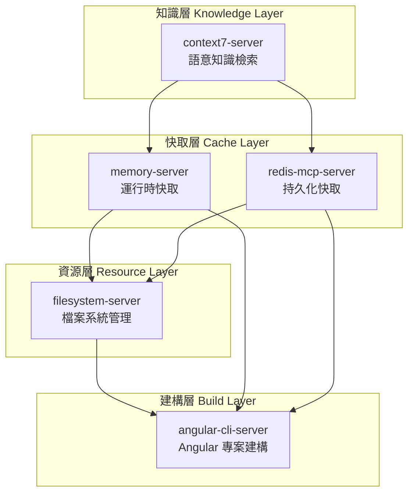
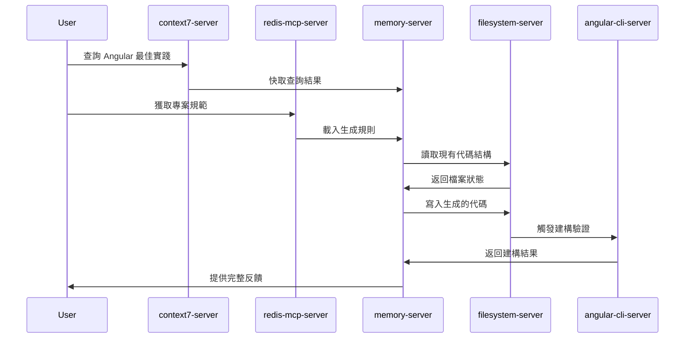
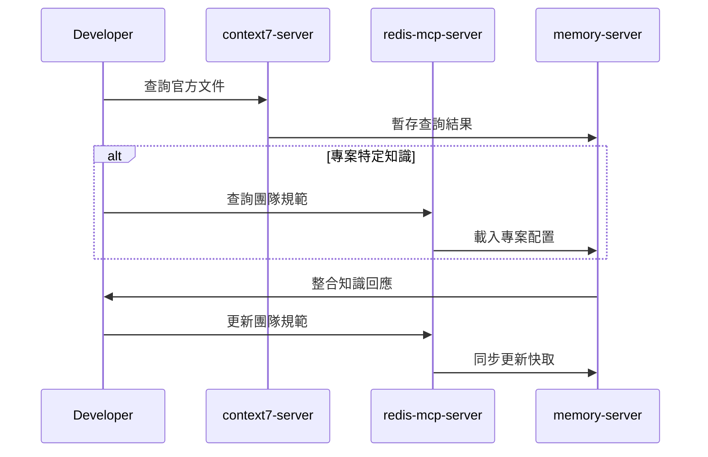

# MCP 協作組織中樞 (MCP Collaboration Hub)

> **本文件為 MCP 服務器協作的核心指南**，定義了五個 MCP 服務器之間的協作架構、數據流向與最佳實踐。
> 
> 遵循極簡主義原則：**清晰的分層、明確的職責、高效的協作**。

---

## 🏗️ 架構總覽 (Architecture Overview)



---

## 🎯 核心協作原則 (Core Collaboration Principles)

### 1. 知識查詢優先順序 (Knowledge Query Priority)
```
context7 (權威知識) → redis (專案快取) → memory (臨時狀態) → filesystem (檔案資源)
```

### 2. 代碼生成流程 (Code Generation Flow)
```
context7 查詢最佳實踐 → redis 獲取專案規範 → memory 管理生成狀態 → filesystem 讀寫檔案 → angular-cli 建構驗證
```

### 3. 數據一致性保證 (Data Consistency)
- **memory-server**: 臨時狀態，會話級別
- **redis-mcp-server**: 持久化配置，專案級別  
- **filesystem-server**: 源碼真實狀態，版本控制級別

---

## 🔧 各服務器角色定位 (Server Role Definition)

### 🧠 context7-server (知識中樞)
**角色**: 權威知識查詢與語意檢索
- **主要功能**: Angular 官方文件、API 規範、最佳實踐查詢
- **協作方式**: 為其他服務器提供權威技術參考
- **數據流向**: context7 → redis (快取查詢結果) → memory (臨時存儲)

### ⚡ memory-server (運行時快取)
**角色**: 高速臨時狀態管理
- **主要功能**: 會話狀態、生成上下文、用戶偏好暫存
- **協作方式**: 減少對持久層的頻繁訪問，提升響應速度
- **數據流向**: 接收所有服務器的臨時數據，提供快速讀寫

### 🗄️ redis-mcp-server (持久化快取)
**角色**: 專案配置與規則存儲
- **主要功能**: 團隊規範、代碼模板、權限配置、生成規則
- **協作方式**: 為代碼生成提供專案特定的配置和約束
- **數據流向**: redis ↔ filesystem (同步配置) ↔ memory (快取熱點)

### 📁 filesystem-server (檔案系統管理)
**角色**: 源碼與資源的權威存儲
- **主要功能**: 讀寫專案檔案、管理目錄結構、版本控制整合
- **協作方式**: 提供真實的檔案狀態，執行最終的代碼寫入
- **數據流向**: 所有服務器的最終輸出目標

### 🚀 angular-cli-server (建構與驗證)
**角色**: Angular 專案建構與即時反饋
- **主要功能**: CLI 命令執行、熱更新、建構驗證、測試運行
- **協作方式**: 驗證生成代碼的正確性，提供即時反饋
- **數據流向**: 從 filesystem 讀取，提供建構結果給 memory/redis

---

## 🔄 協作工作流程 (Collaboration Workflows)

### 代碼生成標準流程 (Standard Code Generation Flow)


### 知識管理流程 (Knowledge Management Flow)


---

## ⚙️ 配置與啟動 (Configuration & Startup)

### 啟動順序 (Startup Sequence)
1. **redis-mcp-server** (基礎配置層)
2. **filesystem-server** (資源管理層)  
3. **memory-server** (快取層)
4. **context7-server** (知識層)
5. **angular-cli-server** (建構層)

### 健康檢查 (Health Check)
```bash
# 檢查所有 MCP 服務器狀態
npm run mcp:health-check
```

---

## 🔍 監控與除錯 (Monitoring & Debugging)

### 關鍵指標 (Key Metrics)
- **context7**: 查詢響應時間、快取命中率
- **redis**: 記憶體使用率、鍵空間統計
- **memory**: 會話數量、快取大小
- **filesystem**: 檔案操作頻率、錯誤率
- **angular-cli**: 建構時間、測試通過率

### 除錯工具 (Debug Tools)
```bash
# 查看 MCP 服務器日誌
npm run mcp:logs

# 檢查服務器間通信
npm run mcp:trace-communication

# 重置所有快取
npm run mcp:reset-cache
```

---

## 🚀 擴展性設計 (Scalability Design)

### 水平擴展 (Horizontal Scaling)
- **memory-server**: 支援多實例負載均衡
- **redis-mcp-server**: 支援 Redis 叢集模式
- **filesystem-server**: 支援分散式檔案系統

### 垂直擴展 (Vertical Scaling)  
- **context7-server**: 支援更大的知識庫索引
- **angular-cli-server**: 支援並行建構任務

---

## 📋 最佳實踐檢查清單 (Best Practices Checklist)

### ✅ 代碼生成前 (Before Code Generation)
- [ ] 透過 context7 查詢最新最佳實踐
- [ ] 從 redis 載入專案特定規範  
- [ ] 檢查 filesystem 中的現有代碼結構
- [ ] 在 memory 中初始化生成上下文

### ✅ 代碼生成中 (During Code Generation)
- [ ] 使用 memory 管理生成狀態
- [ ] 遵循 redis 中的團隊規範
- [ ] 透過 filesystem 進行檔案操作
- [ ] 即時更新 memory 中的進度

### ✅ 代碼生成後 (After Code Generation)
- [ ] 使用 angular-cli 驗證生成的代碼
- [ ] 執行測試確保代碼品質
- [ ] 更新 redis 中的專案狀態
- [ ] 清理 memory 中的臨時數據

---

## 🎯 效能最佳化建議 (Performance Optimization)

### 快取策略 (Caching Strategy)
- **熱點數據**: memory-server (毫秒級存取)
- **配置數據**: redis-mcp-server (秒級存取)  
- **檔案數據**: filesystem-server (按需載入)

### 並發控制 (Concurrency Control)
- **讀操作**: 支援高並發
- **寫操作**: 使用鎖機制保證一致性
- **建構操作**: 佇列管理避免衝突

---

> **核心理念**: 五個 MCP 服務器協同工作，形成一個高效、可擴展的代碼生成生態系統。
> 
> **設計哲學**: 簡單的架構，清晰的職責，高效的協作。

