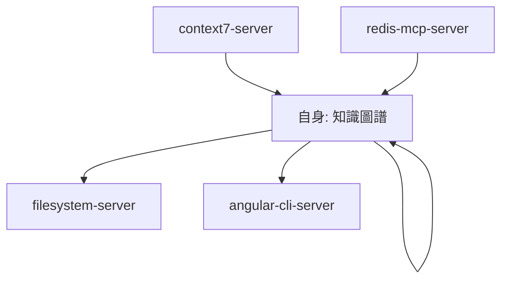
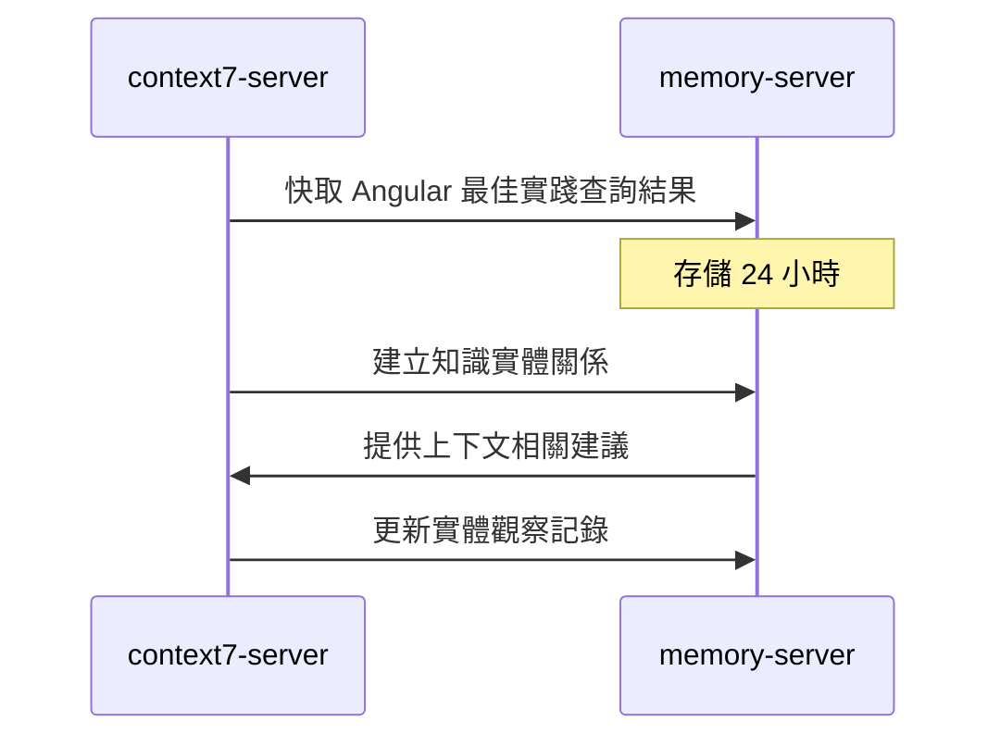
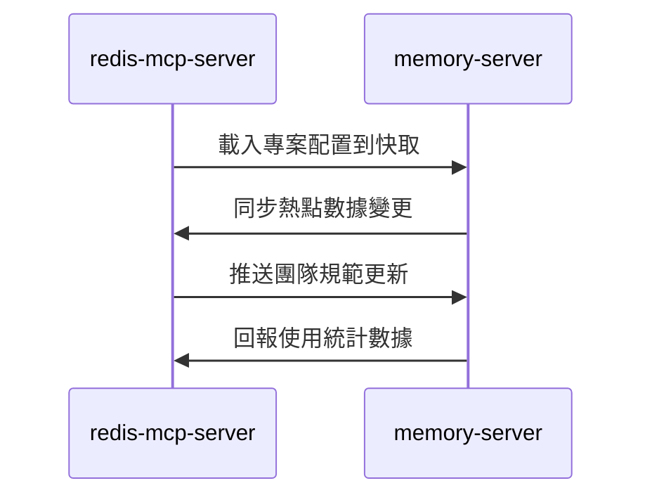
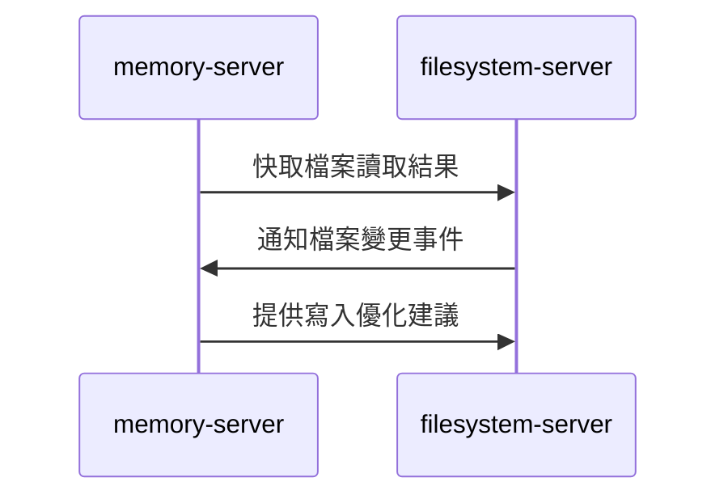

# memory-server (運行時快取服務器)

> **memory-server 是 MCP 生態系統的高速運行時快取中樞**，負責會話狀態、臨時數據、生成上下文的快速存取與管理。
> 
> 遵循 **即時響應** 原則：提供毫秒級的數據存取，確保代碼生成流程的流暢性。

---

## 🎯 角色定位 (Role Definition)

### 核心職責
- **會話狀態管理**: 存儲用戶會話、對話上下文、生成進度
- **臨時數據快取**: 快取熱點查詢結果、中間計算結果
- **知識圖譜構建**: 在對話中建立實體關係，組織複雜知識結構
- **並發協調**: 管理多用戶並發操作，保障數據一致性

### 在 MCP 生態中的位置


---

## ⚙️ 配置與啟動 (Configuration & Startup)

### 啟動命令
```bash
npx -y @modelcontextprotocol/server-memory
```

### 環境要求
- **Node.js**: >= 18.0.0
- **記憶體**: >= 512MB 可用記憶體
- **並發支援**: 支援多用戶同時存取

### 權限配置
```json
{
  "autoApprove": ["*"],
  "description": "信任範圍內自由讀寫，支援所有記憶體操作"
}
```

---

## 🧠 知識圖譜功能 (Knowledge Graph Functions)

### 1. 實體管理 (Entity Management)
```typescript
// 創建專案實體
mcp_memory_create_entities({
  entities: [
    {
      name: "UserProfileComponent",
      entityType: "Component",
      observations: [
        "使用 signals 管理用戶狀態",
        "實現 OnPush 變更檢測策略",
        "整合 ng-zorro-antd 表單元件"
      ]
    },
    {
      name: "UserService",
      entityType: "Service",
      observations: [
        "提供用戶 CRUD 操作",
        "使用 inject() 函數注入依賴",
        "實現 signals 狀態管理"
      ]
    }
  ]
});
```

### 2. 關係建立 (Relationship Creation)
```typescript
// 建立實體間關係
mcp_memory_create_relations({
  relations: [
    {
      from: "UserProfileComponent",
      relationType: "uses",
      to: "UserService"
    },
    {
      from: "UserService",
      relationType: "implements",
      to: "CrudInterface"
    }
  ]
});
```

### 3. 觀察記錄 (Observation Management)
```typescript
// 添加新觀察
mcp_memory_add_observations({
  observations: [
    {
      entityName: "UserProfileComponent",
      contents: [
        "新增響應式表單驗證",
        "整合 Angular Material 主題",
        "實現無障礙功能支援"
      ]
    }
  ]
});
```

### 4. 知識查詢 (Knowledge Query)
```typescript
// 搜尋相關實體
mcp_memory_search_nodes({
  query: "User Component signals"
});

// 開啟特定節點
mcp_memory_open_nodes({
  names: ["UserProfileComponent", "UserService"]
});

// 讀取完整圖譜
mcp_memory_read_graph();
```

---

## 🚀 協作模式 (Collaboration Patterns)

### 與 context7-server 協作


### 與 redis-mcp-server 協作


### 與 filesystem-server 協作


---

## 💾 數據結構設計 (Data Structure Design)

### 會話狀態管理
```typescript
// 會話狀態結構
interface SessionState {
  sessionId: string;
  userId: string;
  currentProject: string;
  generationContext: {
    targetComponent: string;
    generationStep: number;
    completedTasks: string[];
    pendingTasks: string[];
  };
  preferences: {
    codeStyle: "minimal" | "detailed";
    framework: "ng-alain" | "angular-material";
    testingStrategy: "unit" | "integration" | "e2e";
  };
  timestamp: number;
}
```

### 臨時快取結構
```typescript
// 快取數據結構
interface CacheEntry {
  key: string;
  value: any;
  source: "context7" | "redis" | "filesystem";
  ttl: number; // 生存時間（秒）
  accessCount: number;
  lastAccessed: number;
  tags: string[]; // 用於批量清理
}
```

### 知識圖譜結構
```typescript
// 實體結構
interface Entity {
  name: string;
  entityType: "Component" | "Service" | "Module" | "Interface" | "Pipe" | "Directive";
  observations: string[];
  relationships: Relationship[];
  metadata: {
    created: number;
    updated: number;
    source: string;
  };
}

// 關係結構
interface Relationship {
  from: string;
  to: string;
  relationType: "uses" | "implements" | "extends" | "contains" | "depends_on";
  strength: number; // 關係強度 0-1
}
```

---

## ⚡ 效能最佳化 (Performance Optimization)

### 快取策略
```typescript
// 多層快取策略
const cacheStrategy = {
  L1: {
    type: "in-memory",
    size: "64MB",
    ttl: "5 minutes",
    usage: "熱點數據"
  },
  L2: {
    type: "session-based",
    size: "256MB", 
    ttl: "30 minutes",
    usage: "會話數據"
  },
  L3: {
    type: "knowledge-graph",
    size: "512MB",
    ttl: "2 hours",
    usage: "知識關係"
  }
};
```

### 並發控制
```typescript
// 並發操作管理
interface ConcurrencyControl {
  maxConcurrentUsers: 50;
  maxOperationsPerUser: 100;
  lockTimeout: 5000; // 5 秒
  queueSize: 1000;
  rateLimiting: {
    requestsPerMinute: 1000;
    burstSize: 100;
  };
}
```

---

## 🔍 監控與除錯 (Monitoring & Debugging)

### 關鍵指標
```typescript
// 效能指標
const performanceMetrics = {
  responseTime: "< 10ms",
  memoryUsage: "< 512MB",
  cacheHitRate: "> 95%",
  concurrentUsers: "< 50",
  operationsPerSecond: "> 1000"
};

// 健康檢查
const healthCheck = {
  memoryLeaks: "檢查記憶體洩漏",
  cacheEfficiency: "快取效率分析", 
  sessionCleanup: "過期會話清理",
  graphConsistency: "知識圖譜一致性"
};
```

### 除錯工具
```bash
# 查看記憶體使用狀況
npm run memory:status

# 分析快取效率
npm run memory:cache-analysis

# 檢查知識圖譜
npm run memory:graph-inspect

# 清理過期數據
npm run memory:cleanup
```

---

## 📚 使用場景範例 (Usage Scenarios)

### 1. 代碼生成會話管理
```typescript
// 開始代碼生成會話
const session = {
  sessionId: "gen_20241217_001",
  project: "user-management-system",
  target: "UserProfileComponent",
  context: {
    framework: "ng-alain",
    version: "20",
    features: ["signals", "standalone", "onpush"]
  }
};

// 存儲會話狀態
mcp_memory_create_entities({
  entities: [{
    name: "CodeGenSession_001",
    entityType: "Session",
    observations: [
      "目標: 生成 UserProfileComponent",
      "框架: ng-alain v20",
      "特性: signals + standalone + OnPush"
    ]
  }]
});
```

### 2. 知識關係建立
```typescript
// 建立專案架構知識圖譜
const projectArchitecture = [
  // 模組關係
  { from: "AppModule", relationType: "contains", to: "UserModule" },
  { from: "UserModule", relationType: "contains", to: "UserProfileComponent" },
  
  // 服務依賴
  { from: "UserProfileComponent", relationType: "uses", to: "UserService" },
  { from: "UserService", relationType: "uses", to: "HttpClient" },
  
  // 介面實現
  { from: "UserService", relationType: "implements", to: "UserServiceInterface" }
];

mcp_memory_create_relations({ relations: projectArchitecture });
```

### 3. 臨時快取管理
```typescript
// 快取 context7 查詢結果
const cacheAngularBestPractices = {
  key: "angular_v20_signals_best_practices",
  value: {
    summary: "Angular 20 signals 最佳實踐",
    practices: [
      "使用 signal() 替代 BehaviorSubject",
      "computed() 用於衍生狀態",
      "effect() 處理副作用"
    ],
    examples: ["// signal 範例代碼"]
  },
  ttl: 3600, // 1 小時
  source: "context7"
};
```

---

## 📋 使用檢查清單 (Usage Checklist)

### ✅ 會話管理
- [ ] 為每個代碼生成任務創建會話
- [ ] 記錄生成進度和上下文
- [ ] 定期清理過期會話
- [ ] 監控並發會話數量

### ✅ 快取管理
- [ ] 快取熱點查詢結果
- [ ] 設置適當的 TTL
- [ ] 監控快取命中率
- [ ] 定期清理過期快取

### ✅ 知識圖譜
- [ ] 建立實體間的邏輯關係
- [ ] 記錄重要的觀察和發現
- [ ] 保持圖譜結構的一致性
- [ ] 定期備份重要知識

### ✅ 效能監控
- [ ] 監控記憶體使用量
- [ ] 檢查響應時間
- [ ] 分析並發處理能力
- [ ] 優化熱點操作

---

## 🚀 進階功能 (Advanced Features)

### 智能預測快取
```typescript
// 基於使用模式的預測快取
const predictiveCache = {
  userBehaviorAnalysis: "分析用戶操作模式",
  preloadStrategy: "預載可能需要的數據",
  adaptiveTTL: "根據使用頻率調整 TTL",
  contextAwareness: "基於上下文預測需求"
};
```

### 分散式會話同步
```typescript
// 多實例會話同步
const distributedSession = {
  sessionReplication: "會話數據複製",
  loadBalancing: "負載均衡",
  failover: "故障轉移",
  consistency: "數據一致性保證"
};
```

---

> **核心原則**: memory-server 提供毫秒級響應，確保代碼生成流程的流暢性和用戶體驗。
> 
> **協作理念**: 作為高速快取層，協調其他 MCP 服務器間的數據流動，提升整體系統效能。

