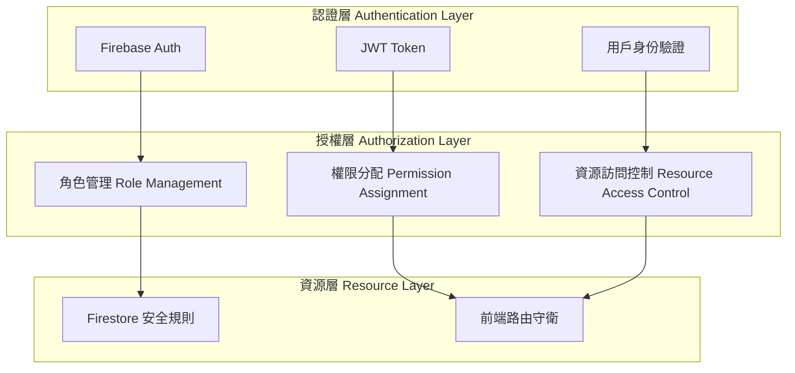
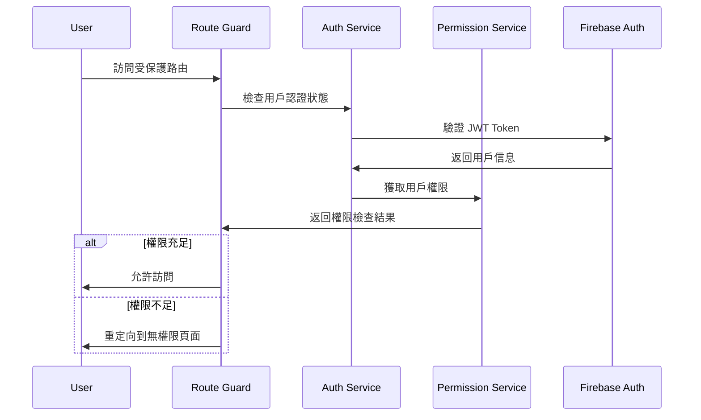

# 權限管理系統 (Permission Management System)

> **本專案採用基於角色的訪問控制 (RBAC) 架構**，結合 Firebase Auth 與 Firestore 安全規則，實現細粒度的權限管理。
> 
> 設計原則：**最小權限、職責分離、安全優先、易於管理**。

---

## 🎯 權限系統架構 (Permission System Architecture)



---

## 👥 角色權限對應表 (Role-Permission Matrix)

### 系統角色定義
```typescript
enum UserRole {
  SUPER_ADMIN = 'super_admin',    // 超級管理員
  ADMIN = 'admin',                // 系統管理員
  MANAGER = 'manager',            // 部門經理
  DEVELOPER = 'developer',        // 開發人員
  USER = 'user',                  // 一般用戶
  GUEST = 'guest'                 // 訪客
}

enum Permission {
  // 用戶管理
  USER_CREATE = 'user:create',
  USER_READ = 'user:read',
  USER_UPDATE = 'user:update',
  USER_DELETE = 'user:delete',
  
  // 系統管理
  SYSTEM_CONFIG = 'system:config',
  SYSTEM_MONITOR = 'system:monitor',
  SYSTEM_BACKUP = 'system:backup',
  
  // 專案管理
  PROJECT_CREATE = 'project:create',
  PROJECT_READ = 'project:read',
  PROJECT_UPDATE = 'project:update',
  PROJECT_DELETE = 'project:delete',
  
  // MCP 管理
  MCP_MANAGE = 'mcp:manage',
  MCP_MONITOR = 'mcp:monitor',
  
  // 代碼生成
  CODE_GENERATE = 'code:generate',
  CODE_TEMPLATE = 'code:template',
  
  // 知識管理
  KNOWLEDGE_READ = 'knowledge:read',
  KNOWLEDGE_WRITE = 'knowledge:write'
}
```

### 角色權限矩陣
```typescript
const rolePermissions: Record<UserRole, Permission[]> = {
  [UserRole.SUPER_ADMIN]: [
    // 擁有所有權限
    ...Object.values(Permission)
  ],
  
  [UserRole.ADMIN]: [
    Permission.USER_CREATE,
    Permission.USER_READ,
    Permission.USER_UPDATE,
    Permission.USER_DELETE,
    Permission.SYSTEM_CONFIG,
    Permission.SYSTEM_MONITOR,
    Permission.PROJECT_CREATE,
    Permission.PROJECT_READ,
    Permission.PROJECT_UPDATE,
    Permission.PROJECT_DELETE,
    Permission.MCP_MANAGE,
    Permission.MCP_MONITOR,
    Permission.CODE_GENERATE,
    Permission.CODE_TEMPLATE,
    Permission.KNOWLEDGE_READ,
    Permission.KNOWLEDGE_WRITE
  ],
  
  [UserRole.MANAGER]: [
    Permission.USER_READ,
    Permission.USER_UPDATE,
    Permission.PROJECT_CREATE,
    Permission.PROJECT_READ,
    Permission.PROJECT_UPDATE,
    Permission.MCP_MONITOR,
    Permission.CODE_GENERATE,
    Permission.KNOWLEDGE_READ,
    Permission.KNOWLEDGE_WRITE
  ],
  
  [UserRole.DEVELOPER]: [
    Permission.USER_READ,
    Permission.PROJECT_READ,
    Permission.PROJECT_UPDATE,
    Permission.MCP_MONITOR,
    Permission.CODE_GENERATE,
    Permission.CODE_TEMPLATE,
    Permission.KNOWLEDGE_READ,
    Permission.KNOWLEDGE_WRITE
  ],
  
  [UserRole.USER]: [
    Permission.USER_READ,
    Permission.PROJECT_READ,
    Permission.CODE_GENERATE,
    Permission.KNOWLEDGE_READ
  ],
  
  [UserRole.GUEST]: [
    Permission.KNOWLEDGE_READ
  ]
};
```

---

## 🔐 權限驗證流程 (Permission Verification Flow)

### 前端權限檢查流程



---

## 🛡️ 權限相關元件與服務 (Permission Components & Services)

### 1. 認證服務 (Auth Service)
```typescript
@Injectable({
  providedIn: 'root'
})
export class AuthService {
  private currentUser = signal<User | null>(null);
  private userRole = signal<UserRole | null>(null);
  
  constructor(
    private auth: Auth,
    private firestore: Firestore
  ) {
    // 監聽認證狀態變化
    authState(this.auth).subscribe(async (user) => {
      if (user) {
        this.currentUser.set(user);
        await this.loadUserRole(user.uid);
      } else {
        this.currentUser.set(null);
        this.userRole.set(null);
      }
    });
  }
  
  private async loadUserRole(uid: string): Promise<void> {
    const userDoc = await getDoc(doc(this.firestore, 'users', uid));
    const userData = userDoc.data();
    this.userRole.set(userData?.role || UserRole.GUEST);
  }
  
  // 登入
  async signIn(email: string, password: string): Promise<void> {
    await signInWithEmailAndPassword(this.auth, email, password);
  }
  
  // 登出
  async signOut(): Promise<void> {
    await signOut(this.auth);
  }
  
  // 獲取當前用戶
  getCurrentUser(): Signal<User | null> {
    return this.currentUser.asReadonly();
  }
  
  // 獲取用戶角色
  getUserRole(): Signal<UserRole | null> {
    return this.userRole.asReadonly();
  }
}
```

### 2. 權限服務 (Permission Service)
```typescript
@Injectable({
  providedIn: 'root'
})
export class PermissionService {
  constructor(private authService: AuthService) {}
  
  // 檢查是否有特定權限
  hasPermission(permission: Permission): boolean {
    const role = this.authService.getUserRole()();
    if (!role) return false;
    
    return rolePermissions[role].includes(permission);
  }
  
  // 檢查是否有任一權限
  hasAnyPermission(permissions: Permission[]): boolean {
    return permissions.some(permission => this.hasPermission(permission));
  }
  
  // 檢查是否有所有權限
  hasAllPermissions(permissions: Permission[]): boolean {
    return permissions.every(permission => this.hasPermission(permission));
  }
  
  // 檢查角色
  hasRole(role: UserRole): boolean {
    return this.authService.getUserRole()() === role;
  }
  
  // 檢查是否為管理員
  isAdmin(): boolean {
    const role = this.authService.getUserRole()();
    return role === UserRole.ADMIN || role === UserRole.SUPER_ADMIN;
  }
}
```

### 3. 路由守衛 (Route Guards)
```typescript
@Injectable({
  providedIn: 'root'
})
export class AuthGuard implements CanActivate {
  constructor(
    private authService: AuthService,
    private router: Router
  ) {}
  
  canActivate(): boolean {
    const user = this.authService.getCurrentUser()();
    
    if (user) {
      return true;
    } else {
      this.router.navigate(['/login']);
      return false;
    }
  }
}

@Injectable({
  providedIn: 'root'
})
export class PermissionGuard implements CanActivate {
  constructor(
    private permissionService: PermissionService,
    private router: Router
  ) {}
  
  canActivate(route: ActivatedRouteSnapshot): boolean {
    const requiredPermissions = route.data['permissions'] as Permission[];
    
    if (!requiredPermissions || requiredPermissions.length === 0) {
      return true;
    }
    
    const hasPermission = this.permissionService.hasAnyPermission(requiredPermissions);
    
    if (!hasPermission) {
      this.router.navigate(['/unauthorized']);
      return false;
    }
    
    return true;
  }
}
```

### 4. 權限指令 (Permission Directive)
```typescript
@Directive({
  selector: '[hasPermission]',
  standalone: true
})
export class HasPermissionDirective implements OnInit {
  @Input() hasPermission!: Permission | Permission[];
  @Input() hasPermissionElse?: TemplateRef<any>;
  
  constructor(
    private templateRef: TemplateRef<any>,
    private viewContainer: ViewContainerRef,
    private permissionService: PermissionService
  ) {}
  
  ngOnInit(): void {
    this.updateView();
  }
  
  private updateView(): void {
    const permissions = Array.isArray(this.hasPermission) 
      ? this.hasPermission 
      : [this.hasPermission];
    
    const hasPermission = this.permissionService.hasAnyPermission(permissions);
    
    this.viewContainer.clear();
    
    if (hasPermission) {
      this.viewContainer.createEmbeddedView(this.templateRef);
    } else if (this.hasPermissionElse) {
      this.viewContainer.createEmbeddedView(this.hasPermissionElse);
    }
  }
}
```

### 5. 權限管道 (Permission Pipe)
```typescript
@Pipe({
  name: 'hasPermission',
  standalone: true,
  pure: false
})
export class HasPermissionPipe implements PipeTransform {
  constructor(private permissionService: PermissionService) {}
  
  transform(permission: Permission | Permission[]): boolean {
    if (Array.isArray(permission)) {
      return this.permissionService.hasAnyPermission(permission);
    }
    return this.permissionService.hasPermission(permission);
  }
}
```

---

## 🔥 Firebase 安全規則 (Firestore Security Rules)

### 用戶集合安全規則
```javascript
// firestore.rules
rules_version = '2';
service cloud.firestore {
  match /databases/{database}/documents {
    // 用戶文檔規則
    match /users/{userId} {
      // 用戶只能讀取自己的資料
      allow read: if request.auth != null && request.auth.uid == userId;
      
      // 管理員可以讀取所有用戶資料
      allow read: if request.auth != null && 
        get(/databases/$(database)/documents/users/$(request.auth.uid)).data.role in ['admin', 'super_admin'];
      
      // 用戶可以更新自己的基本資料（除了角色）
      allow update: if request.auth != null && 
        request.auth.uid == userId &&
        !('role' in request.resource.data.diff(resource.data).affectedKeys());
      
      // 只有管理員可以創建和刪除用戶
      allow create, delete: if request.auth != null && 
        get(/databases/$(database)/documents/users/$(request.auth.uid)).data.role in ['admin', 'super_admin'];
    }
    
    // 專案文檔規則
    match /projects/{projectId} {
      // 認證用戶可以讀取專案
      allow read: if request.auth != null;
      
      // 開發人員以上角色可以創建和更新專案
      allow create, update: if request.auth != null && 
        get(/databases/$(database)/documents/users/$(request.auth.uid)).data.role in ['developer', 'manager', 'admin', 'super_admin'];
      
      // 只有管理員可以刪除專案
      allow delete: if request.auth != null && 
        get(/databases/$(database)/documents/users/$(request.auth.uid)).data.role in ['admin', 'super_admin'];
    }
    
    // 知識庫規則
    match /knowledge/{docId} {
      // 所有認證用戶可以讀取
      allow read: if request.auth != null;
      
      // 開發人員以上可以寫入
      allow write: if request.auth != null && 
        get(/databases/$(database)/documents/users/$(request.auth.uid)).data.role in ['developer', 'manager', 'admin', 'super_admin'];
    }
  }
}
```

---

## 🎨 前端權限使用範例 (Frontend Permission Usage)

### 路由配置
```typescript
// app.routes.ts
export const routes: Routes = [
  {
    path: 'dashboard',
    component: DashboardComponent,
    canActivate: [AuthGuard]
  },
  {
    path: 'admin',
    loadChildren: () => import('./admin/admin.routes'),
    canActivate: [AuthGuard, PermissionGuard],
    data: { permissions: [Permission.SYSTEM_CONFIG] }
  },
  {
    path: 'users',
    component: UserListComponent,
    canActivate: [AuthGuard, PermissionGuard],
    data: { permissions: [Permission.USER_READ] }
  },
  {
    path: 'unauthorized',
    component: UnauthorizedComponent
  }
];
```

### 模板中使用權限
```html
<!-- user-list.component.html -->
<div class="user-list">
  <div class="actions">
    <!-- 只有有創建權限的用戶才能看到創建按鈕 -->
    <button 
      *hasPermission="Permission.USER_CREATE"
      nz-button 
      nzType="primary"
      (click)="createUser()">
      創建用戶
    </button>
  </div>
  
  <nz-table [nzData]="users()">
    <thead>
      <tr>
        <th>姓名</th>
        <th>郵箱</th>
        <th>角色</th>
        <th *hasPermission="[Permission.USER_UPDATE, Permission.USER_DELETE]">操作</th>
      </tr>
    </thead>
    <tbody>
      <tr *ngFor="let user of users()">
        <td>{{ user.name }}</td>
        <td>{{ user.email }}</td>
        <td>{{ user.role }}</td>
        <td *hasPermission="[Permission.USER_UPDATE, Permission.USER_DELETE]">
          <button 
            *hasPermission="Permission.USER_UPDATE"
            nz-button 
            nzSize="small"
            (click)="editUser(user)">
            編輯
          </button>
          <button 
            *hasPermission="Permission.USER_DELETE"
            nz-button 
            nzDanger 
            nzSize="small"
            (click)="deleteUser(user)">
            刪除
          </button>
        </td>
      </tr>
    </tbody>
  </nz-table>
</div>
```

### 元件中使用權限
```typescript
// user-list.component.ts
@Component({
  selector: 'app-user-list',
  standalone: true,
  imports: [CommonModule, NzTableModule, NzButtonModule, HasPermissionDirective],
  templateUrl: './user-list.component.html'
})
export class UserListComponent {
  users = signal<User[]>([]);
  Permission = Permission; // 模板中使用
  
  constructor(
    private userService: UserService,
    private permissionService: PermissionService
  ) {}
  
  createUser(): void {
    if (!this.permissionService.hasPermission(Permission.USER_CREATE)) {
      console.warn('沒有創建用戶的權限');
      return;
    }
    
    // 執行創建邏輯
  }
  
  editUser(user: User): void {
    if (!this.permissionService.hasPermission(Permission.USER_UPDATE)) {
      console.warn('沒有編輯用戶的權限');
      return;
    }
    
    // 執行編輯邏輯
  }
  
  deleteUser(user: User): void {
    if (!this.permissionService.hasPermission(Permission.USER_DELETE)) {
      console.warn('沒有刪除用戶的權限');
      return;
    }
    
    // 執行刪除邏輯
  }
}
```

---

## 📋 權限管理檢查清單 (Permission Management Checklist)

### ✅ 設計階段
- [ ] 定義清晰的角色層次結構
- [ ] 設計細粒度的權限系統
- [ ] 規劃資源訪問控制策略
- [ ] 設計權限繼承和組合規則

### ✅ 開發階段
- [ ] 實現認證和授權服務
- [ ] 配置 Firebase 安全規則
- [ ] 實現前端權限檢查
- [ ] 實現後端權限驗證

### ✅ 測試階段
- [ ] 測試各角色權限正確性
- [ ] 測試權限邊界情況
- [ ] 測試安全規則有效性
- [ ] 進行滲透測試

### ✅ 部署階段
- [ ] 配置生產環境權限
- [ ] 設定監控和日誌
- [ ] 建立權限審計機制
- [ ] 準備應急響應計劃

---

## 🔍 權限審計與監控 (Permission Auditing & Monitoring)

### 權限變更日誌
```typescript
// 記錄權限變更
export async function logPermissionChange(
  adminUid: string,
  targetUid: string,
  oldRole: UserRole,
  newRole: UserRole,
  reason: string
): Promise<void> {
  await addDoc(collection(firestore, 'permission_logs'), {
    adminUid,
    targetUid,
    oldRole,
    newRole,
    reason,
    timestamp: serverTimestamp(),
    type: 'role_change'
  });
}

// 記錄權限檢查失敗
export async function logPermissionDenied(
  uid: string,
  resource: string,
  permission: Permission,
  userAgent: string
): Promise<void> {
  await addDoc(collection(firestore, 'security_logs'), {
    uid,
    resource,
    permission,
    userAgent,
    timestamp: serverTimestamp(),
    type: 'permission_denied'
  });
}
```

### 權限監控面板
```typescript
// 權限統計服務
@Injectable({
  providedIn: 'root'
})
export class PermissionStatsService {
  async getPermissionStats(): Promise<PermissionStats> {
    // 獲取各角色用戶數量
    const roleStats = await this.getRoleDistribution();
    
    // 獲取權限使用統計
    const permissionUsage = await this.getPermissionUsage();
    
    // 獲取安全事件統計
    const securityEvents = await this.getSecurityEvents();
    
    return {
      roleStats,
      permissionUsage,
      securityEvents
    };
  }
}
```

---

> **核心原則**: 權限管理系統確保系統安全性，通過最小權限原則和多層防護，保護敏感資源和操作。
> 
> **安全理念**: 預設拒絕、明確授權、定期審計、持續監控。
