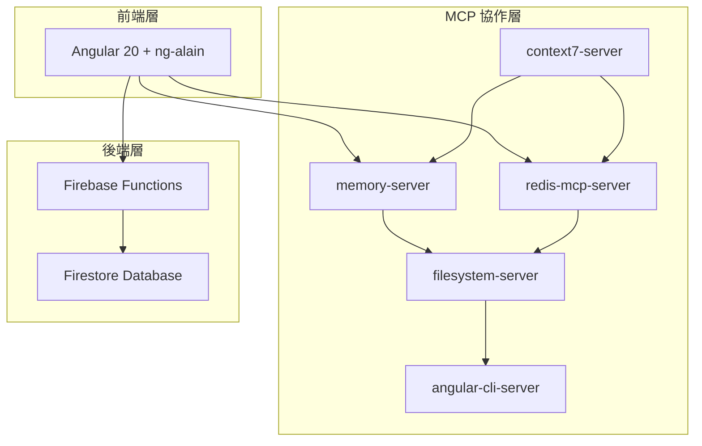
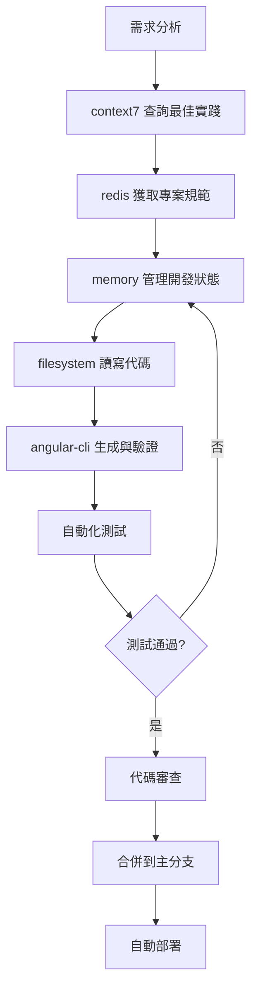

# 專案總覽 (Project Overview)

> **基於 MCP 協作組織架構的 Angular 20 + Firebase 全棧開發平台**
> 
> 整合五個 MCP 服務器，實現高效的代碼生成、知識管理與專案協作。

---

## 🚀 專案簡介 (Project Introduction)

### 核心特色
- **🧠 智能代碼生成**: 透過 MCP 協作系統自動生成高品質 Angular 代碼
- **📚 知識管理中樞**: context7 提供權威技術文檔查詢與最佳實踐
- **⚡ 多層快取架構**: memory + redis 雙重快取，毫秒級響應
- **🔒 企業級安全**: Firebase Auth + Firestore 安全規則
- **🎨 現代化 UI**: ng-alain + ng-zorro-antd 企業級管理界面

### 技術架構


---

## ⚡ 快速啟動 (Quick Start)

### 環境需求
```bash
# 檢查環境
node --version    # >= 18.0.0
ng version       # >= 20.0.0
firebase --version
```

### 1. 專案初始化
```bash
# 克隆專案
git clone <repository-url>
cd project-name

# 安裝前端依賴
npm install

# 安裝後端依賴
cd functions
npm install
cd ..
```

### 2. 啟動 MCP 服務器
```bash
# 啟動 Redis (需要先安裝 Redis)
redis-server

# 啟動各 MCP 服務器 (在不同終端中)
npx -y @modelcontextprotocol/server-memory
npx -y @modelcontextprotocol/server-filesystem ./ng-alain/src ./functions
npx tsx C:/path/to/context7-master/src/index.ts
python C:/path/to/mcp-redis/src/main.py
npx -y @talzach/mcp-angular-cli
```

### 3. 啟動開發環境
```bash
# 啟動 Firebase 模擬器
firebase emulators:start

# 啟動 Angular 開發服務器
ng serve

# 開啟瀏覽器
open http://localhost:4200
```

### 4. 驗證安裝
```bash
# 檢查前端
curl http://localhost:4200

# 檢查 Firebase Functions
curl http://localhost:5001/project-id/region/api/health

# 檢查 MCP 服務器狀態
npm run mcp:health-check
```

---

## 🎯 主要功能 (Key Features)

### 代碼生成與管理
- **🤖 智能代碼生成**: 基於最佳實踐自動生成 Angular 元件、服務、模組
- **📝 代碼模板管理**: 可自定義的代碼模板庫
- **🔍 代碼品質檢查**: ESLint + Prettier + TypeScript 嚴格模式
- **🧪 自動化測試**: 生成後自動執行單元測試驗證

### 知識管理系統
- **📖 權威文檔查詢**: 即時查詢 Angular 20、ng-zorro-antd 官方文檔
- **🧠 知識圖譜**: 建立專案實體關係，組織複雜知識結構
- **💾 專案知識沉澱**: 團隊規範、最佳實踐、反模式記錄
- **🔄 知識同步**: 多層快取確保知識的即時性和一致性

### 企業級管理界面
- **👥 用戶權限管理**: 基於角色的訪問控制 (RBAC)
- **📊 數據可視化**: 豐富的圖表和統計面板
- **🌐 國際化支援**: 多語言界面支援
- **📱 響應式設計**: 適配桌面和移動設備

### 後端服務
- **🔥 Firebase Functions**: 無服務器 API 服務
- **💾 Firestore**: 即時數據同步
- **🔐 Firebase Auth**: 多種認證方式支援
- **📧 通知服務**: 郵件和推送通知

---

## 📁 專案結構 (Project Structure)

```
project-root/
├── ng-alain/                 # Angular 前端應用
│   ├── src/app/
│   │   ├── core/            # 核心服務、守衛、攔截器
│   │   ├── shared/          # 共享元件、管道、指令
│   │   ├── features/        # 功能模組
│   │   ├── layout/          # 佈局元件
│   │   └── routes/          # 路由配置
│   └── ...
├── functions/               # Firebase Functions
│   ├── src/
│   │   ├── api/            # REST API 端點
│   │   ├── services/       # 業務邏輯服務
│   │   ├── utils/          # 工具函數
│   │   └── types/          # TypeScript 類型
│   └── ...
├── re/                     # 專案文檔
│   ├── mcp-overview.md     # MCP 協作中樞
│   ├── architecture.md     # 專案架構
│   ├── coding-guidelines.md # 程式碼規範
│   └── ...
└── .kiro/                  # Kiro IDE 配置
    ├── settings/           # MCP 配置
    └── steering/           # 開發指導規則
```

---

## 🔗 重要連結 (Important Links)

### 📚 文檔資源
- **[MCP 協作中樞](./mcp-overview.md)** - MCP 服務器協作指南
- **[專案架構](./architecture.md)** - 整體架構設計
- **[程式碼規範](./coding-guidelines.md)** - 開發規範與最佳實踐
- **[部署指南](./deployment.md)** - 部署流程與環境配置
- **[測試策略](./testing.md)** - 測試框架與品質保證

### 🛠️ 開發工具
- **[Angular CLI](https://angular.io/cli)** - Angular 官方 CLI 工具
- **[Firebase Console](https://console.firebase.google.com/)** - Firebase 管理控制台
- **[ng-alain](https://ng-alain.com/)** - 企業級 Angular 框架
- **[ng-zorro-antd](https://ng.ant.design/)** - Angular UI 元件庫

### 🚀 部署與監控
- **開發環境**: http://localhost:4200
- **測試環境**: https://project-staging.web.app
- **生產環境**: https://project-prod.web.app
- **Firebase Console**: https://console.firebase.google.com/project/project-id
- **監控面板**: https://console.cloud.google.com/monitoring

### 📊 CI/CD 流程
- **GitHub Actions**: `.github/workflows/`
- **代碼品質檢查**: ESLint + Prettier + TypeScript
- **自動化測試**: 單元測試 + E2E 測試
- **自動部署**: 測試通過後自動部署

---

## 🎯 開發工作流程 (Development Workflow)

### 標準開發流程


### MCP 協作流程
1. **知識查詢**: 透過 context7 獲取權威技術參考
2. **規範獲取**: 從 redis 載入專案特定規範和模板
3. **狀態管理**: 使用 memory 管理開發會話和上下文
4. **代碼操作**: 透過 filesystem 進行檔案讀寫操作
5. **建構驗證**: 使用 angular-cli 執行生成和測試

---

## 📋 常用指令 (Common Commands)

### 開發指令
```bash
# 啟動開發環境
npm run dev

# 代碼生成
ng generate component feature/user-profile --standalone --change-detection=OnPush

# 執行測試
npm run test
npm run e2e

# 代碼檢查
npm run lint
npm run format
```

### 建構與部署
```bash
# 建構應用
ng build --configuration=production

# 部署到 Firebase
firebase deploy

# 查看部署狀態
firebase hosting:sites:list
firebase functions:log
```

### MCP 管理
```bash
# 檢查 MCP 服務器狀態
npm run mcp:status

# 重啟 MCP 服務器
npm run mcp:restart

# 清理快取
npm run mcp:clear-cache
```

---

## 🤝 貢獻指南 (Contributing Guide)

### 開發規範
1. **遵循 Angular 20 極簡主義原則**
2. **使用 TypeScript 嚴格模式，禁用 any 類型**
3. **所有元件使用 OnPush 變更檢測策略**
4. **使用新控制流語法 (@if/@for/@switch)**
5. **代碼生成後必須執行測試驗證**

### 提交流程
1. Fork 專案並創建功能分支
2. 遵循程式碼規範進行開發
3. 執行完整測試套件
4. 提交 Pull Request
5. 通過代碼審查後合併

### 問題回報
- **Bug 回報**: 使用 GitHub Issues
- **功能請求**: 提供詳細的需求描述
- **文檔改進**: 歡迎提交文檔更新

---

## 📞 支援與聯繫 (Support & Contact)

### 技術支援
- **文檔問題**: 查看 `re/` 目錄下的詳細文檔
- **開發問題**: 參考 MCP 協作指南
- **部署問題**: 查看部署指南和常見問題

### 社群資源
- **Angular 官方文檔**: https://angular.io/docs
- **Firebase 文檔**: https://firebase.google.com/docs
- **ng-alain 社群**: https://ng-alain.com/docs
- **ng-zorro-antd 文檔**: https://ng.ant.design/docs

---

## 📄 授權條款 (License)

本專案採用 MIT 授權條款，詳見 [LICENSE](./LICENSE) 檔案。

---

> **專案願景**: 透過 MCP 協作組織架構，打造高效、智能、可維護的企業級 Angular 開發平台。
> 
> **核心價值**: 極簡主義、知識驅動、協作優先、品質保證。
