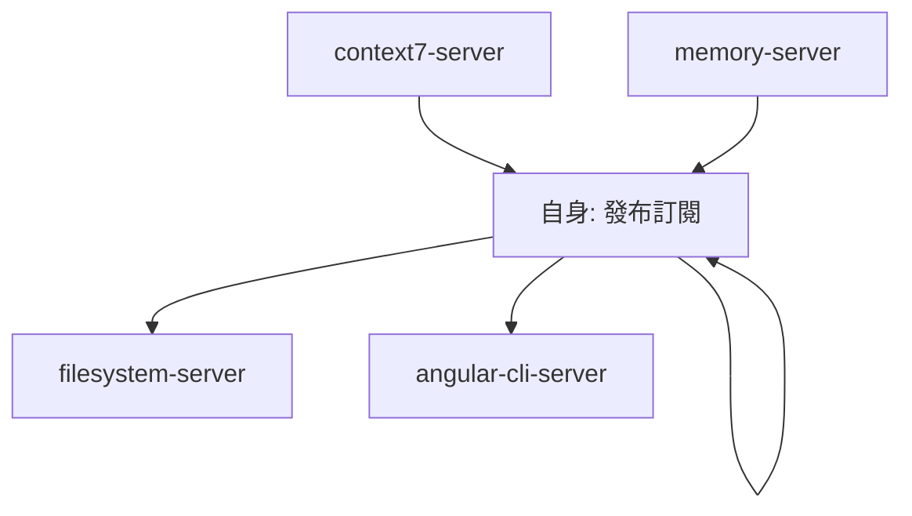
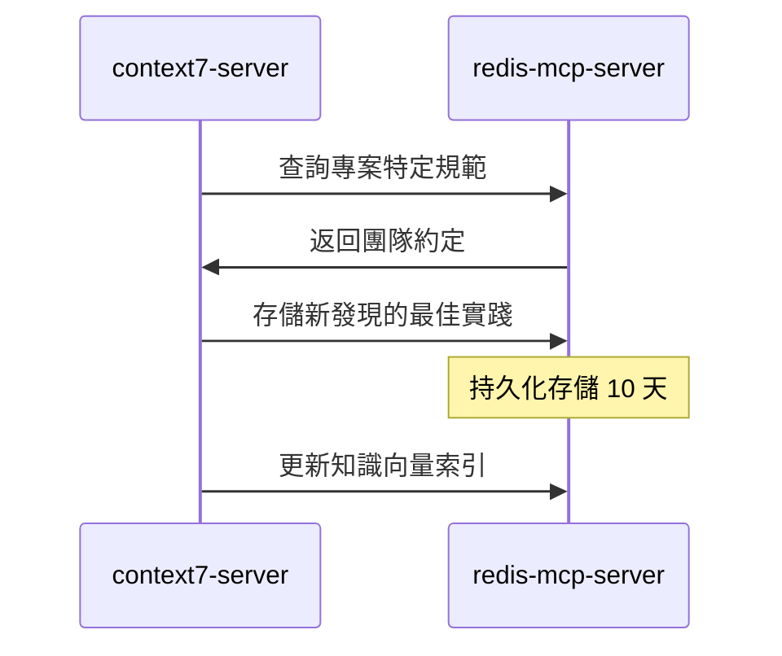
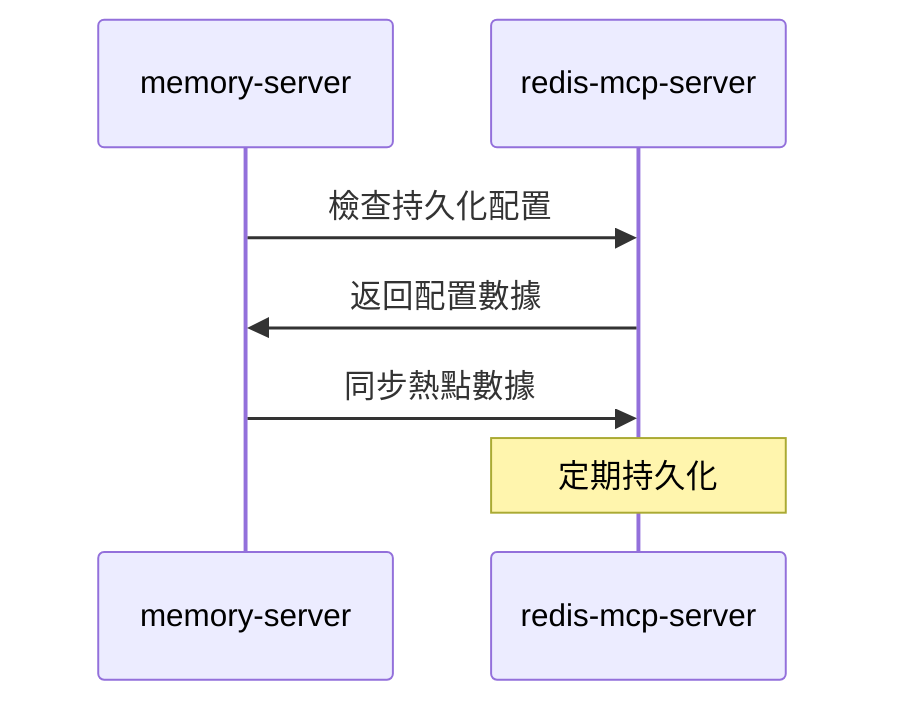
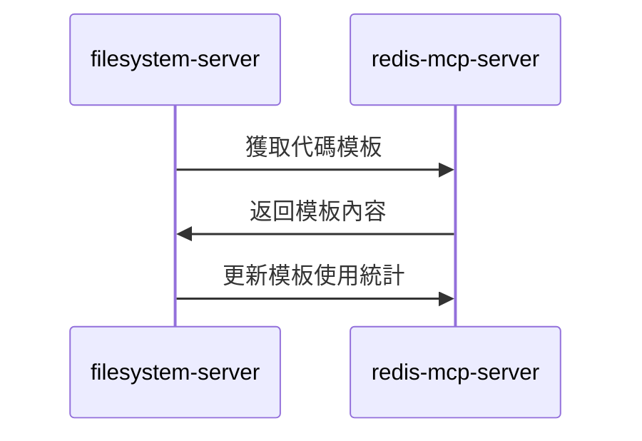

# redis-mcp-server (持久化快取服務器)

> **redis-mcp-server 是 MCP 生態系統的持久化快取中樞**，負責專案配置、團隊規範、代碼模板的存儲與管理。
> 
> 遵循 **專案知識沉澱** 原則：將團隊智慧轉化為可重用的代碼生成資源。

---

## 🎯 角色定位 (Role Definition)

### 核心職責
- **專案配置管理**: 存儲團隊規範、代碼風格、命名約定
- **代碼模板庫**: 管理可重用的代碼片段和生成模板
- **狀態同步**: 協調多個 MCP 服務器間的數據一致性
- **權限控制**: 管理用戶權限和訪問控制規則

### 在 MCP 生態中的位置


---

## ⚙️ 配置與啟動 (Configuration & Startup)

### 啟動命令
```bash
C:\Users\ac7x\pipx\venvs\uv\Scripts\uv.exe --directory C:/Users/ac7x/Documents/GitHub/mcp/mcp-redis run src/main.py
```

### 環境要求
- **Python**: >= 3.8
- **Redis**: >= 6.0
- **uv**: 最新版本 (Python 包管理器)

### 權限配置
```json
{
  "autoApprove": [
    "info", "dbsize", "scan_keys", "scan_all_keys",
    "get", "set", "delete", "expire", "type",
    "hget", "hset", "hgetall", "hdel", "hexists",
    "json_get", "json_set", "json_del",
    "publish", "subscribe", "unsubscribe",
    "vector_search_hash", "create_vector_index_hash"
  ]
}
```

---

## 🗄️ 數據結構設計 (Data Structure Design)

### 專案知識分類系統
```typescript
// Key 命名規範
const keyPatterns = {
  // 專案結構
  project_structure: "project_structure_{topic}",
  
  // 設計決策
  design_decision: "design_decision_{feature}_{decision}",
  
  // 最佳實踐
  best_practice: "best_practice_{domain}_{practice}",
  
  // 反模式
  anti_pattern: "anti_pattern_{domain}_{pattern}",
  
  // 團隊約定
  team_convention: "team_convention_{area}_{rule}",
  
  // 代碼模板
  code_template: "code_template_{type}_{name}",
  
  // 套件差異
  package_diff: "{package_name}:{version}_{topic}"
};
```

### 套件版本管理
```typescript
// 套件差異比對 Key 格式
const packageKeys = {
  // 原始套件
  "ng-alain/ng-alain": "ng-alain/ng-alain:*",
  
  // 內部分支
  "ac484/ng-alain": "ac484/ng-alain:*",
  
  // Context7 官方文件
  "angular_v20": "angular_v20:*",
  "angular_v20_rxjs_v7": "angular_v20_rxjs_v7:*",
  "ng-alain_v20": "ng-alain_v20:*",
  "ng-zorro-antd_v20": "ng-zorro-antd_v20:*",
  "angularfire_v20": "angularfire_v20:*"
};
```

---

## 🔧 主要功能 (Core Functions)

### 1. 基本鍵值操作
```typescript
// 設置專案規範
mcp_redis_mcp_set({
  key: "team_convention_HttpClientModule",
  value: JSON.stringify({
    summary: "所有 Angular feature module 需要使用 HTTP 請求功能時，必須明確匯入 HttpClientModule",
    source: "Team Convention",
    scope: "All Angular Modules",
    examples: ["import { HttpClientModule } from '@angular/common/http';"]
  }),
  expiration: 240 * 3600 // 10 天
});

// 獲取專案規範
mcp_redis_mcp_get({
  key: "team_convention_HttpClientModule"
});
```

### 2. 結構化數據操作 (Hash)
```typescript
// 存儲代碼模板
mcp_redis_mcp_hset({
  name: "code_template_component_signals",
  key: "template",
  value: `
@Component({
  selector: 'app-{{name}}',
  standalone: true,
  changeDetection: ChangeDetectionStrategy.OnPush,
  template: \`
    @if (data(); as items) {
      @for (item of items; track item.id) {
        <div>{{ item.name }}</div>
      }
    }
  \`
})
export class {{PascalName}}Component {
  data = signal<{{Type}}[]>([]);
}`,
  expire_seconds: 240 * 3600
});
```

### 3. JSON 文檔操作
```typescript
// 存儲複雜的專案配置
mcp_redis_mcp_json_set({
  name: "project_config_angular20",
  path: "$",
  value: {
    version: "20.0.0",
    features: {
      signals: true,
      controlFlow: true,
      zoneless: true
    },
    conventions: {
      changeDetection: "OnPush",
      componentType: "standalone",
      stateManagement: "signals"
    },
    antiPatterns: [
      "any_type_usage",
      "ngIf_ngFor_usage",
      "unnecessary_services"
    ]
  },
  expire_seconds: 240 * 3600
});
```

### 4. 向量搜索 (Vector Search)
```typescript
// 創建向量索引用於語意搜索
mcp_redis_mcp_create_vector_index_hash({
  index_name: "code_knowledge_index",
  prefix: "knowledge:",
  vector_field: "embedding",
  dim: 1536,
  distance_metric: "COSINE"
});

// 執行語意搜索
mcp_redis_mcp_vector_search_hash({
  query_vector: [0.1, 0.2, 0.3, ...], // 查詢向量
  index_name: "code_knowledge_index",
  k: 5,
  return_fields: ["content", "category", "source"]
});
```

---

## 🚀 協作模式 (Collaboration Patterns)

### 與 context7-server 協作


### 與 memory-server 協作


### 與 filesystem-server 協作


---

## 📚 專案知識管理 (Project Knowledge Management)

### 1. 團隊約定存儲
```typescript
// HttpClientModule 約定
const httpClientConvention = {
  key: "team_convention_HttpClientModule",
  value: {
    summary: "所有 Angular feature module 需要使用 HTTP 請求功能時，必須明確匯入 HttpClientModule",
    rules: [
      "在 feature module 中明確匯入 HttpClientModule",
      "測試模組中使用 HttpClientTestingModule",
      "避免使用過時的 HttpModule"
    ],
    examples: [
      "import { HttpClientModule } from '@angular/common/http';",
      "imports: [HttpClientModule]"
    ],
    antiPatterns: [
      "使用 HttpModule",
      "忘記在測試中匯入 HttpClientTestingModule"
    ]
  }
};
```

### 2. 套件差異管理
```typescript
// ng-alain 原始版本 vs 內部分支差異
const packageDiff = {
  "ng-alain/ng-alain:layout_system": {
    original: "使用傳統 NgModule 架構",
    internal: "升級為 Standalone Components",
    migration: "將 LayoutModule 重構為 Standalone"
  },
  "ac484/ng-alain:signals_integration": {
    enhancement: "全面整合 Angular 20 signals",
    changes: [
      "狀態管理改用 signals",
      "表單控制使用 signal-based reactive forms",
      "路由狀態使用 signals"
    ]
  }
};
```

### 3. 代碼生成規則
```typescript
// Angular 20 代碼生成規則
const codeGenRules = {
  component: {
    template: "standalone + OnPush + signals",
    controlFlow: "@if/@for/@switch",
    stateManagement: "signal() + computed()",
    styling: "Angular Material 優先"
  },
  service: {
    injection: "inject() 函數優先",
    stateManagement: "signals 替代 BehaviorSubject",
    errorHandling: "統一錯誤處理機制"
  }
};
```

---

## 🔍 監控與維護 (Monitoring & Maintenance)

### 關鍵指標
```typescript
// 監控指標
const metrics = {
  memoryUsage: "< 512MB",
  keyCount: "< 10000",
  hitRate: "> 90%",
  responseTime: "< 10ms",
  persistence: "每 6 小時備份"
};
```

### 數據清理策略
```typescript
// 自動清理過期數據
const cleanupStrategy = {
  temporaryData: "24 小時",
  projectConfig: "240 小時 (10 天)",
  codeTemplates: "720 小時 (30 天)",
  teamConventions: "永久保存"
};
```

---

## 📋 使用檢查清單 (Usage Checklist)

### ✅ 數據存儲前
- [ ] 確認 Key 命名符合規範
- [ ] 設置適當的過期時間
- [ ] 驗證數據結構完整性
- [ ] 檢查是否需要向量索引

### ✅ 數據查詢時
- [ ] 使用正確的查詢方法
- [ ] 檢查數據是否過期
- [ ] 驗證返回數據格式
- [ ] 更新訪問統計

### ✅ 協作整合
- [ ] 與 context7 同步最新知識
- [ ] 向 memory 提供熱點數據
- [ ] 為 filesystem 提供模板
- [ ] 支援 angular-cli 的配置需求

---

## 🚀 進階功能 (Advanced Features)

### 發布訂閱機制
```typescript
// 發布代碼生成事件
mcp_redis_mcp_publish({
  channel: "code_generation",
  message: JSON.stringify({
    event: "component_generated",
    component: "UserProfileComponent",
    timestamp: Date.now()
  })
});

// 訂閱事件
mcp_redis_mcp_subscribe({
  channel: "code_generation"
});
```

### 智能快取策略
```typescript
// 基於使用頻率的智能快取
const cacheStrategy = {
  hotData: "memory + redis (永久)",
  warmData: "redis (30 天)",
  coldData: "redis (10 天)",
  archiveData: "僅 filesystem 備份"
};
```

---

> **核心原則**: redis-mcp-server 是專案知識的持久化中樞，確保團隊智慧得以沉澱和重用。
> 
> **協作理念**: 通過結構化存儲和智能檢索，將專案經驗轉化為高效的代碼生成資源。

# mcp-redis 使用指南

> 本文件詳細說明 `mcp-redis` 的使用方法與儲存規範。
> 關於它在專案知識管理中的整體定位與 `context7` 的協作關係，請參考 **[`@project-knowledge-rules.md`](./project-knowledge-rules.md)**。

---

## 1. 什麼是 mcp-redis？
`mcp-redis` 是專案**內部**的知識快取系統。它用於儲存那些 `context7` 無法涵蓋的、專案特有或團隊內部約定的知識。

## 2. 主要用途
- **快取專案特有知識**：如團隊自訂的命名規則、特定業務場景下的 `signals` 實踐、專案的詳細模組結構等。
- **記錄團隊共識**：如程式碼審查流程、特定的反模式、常見的業務邏輯錯誤。
- **查詢 `context7` 查無的內部知識**：當一個問題的答案是專案或團隊內部約定時，`mcp-redis` 是最終的知識來源。

## 3. 儲存格式與保存時間

- **Key 格式**：`分類_主題_細節` (e.g., `anti_pattern_any_type`, `project_structure_flat`)
- **Value 格式**：JSON 字串，需包含具體內容、來源、適用範圍、建議修正方式（如有）。
- **保存時間**：至少 `240` 小時 (10 天)。

## 4. 套件差異比對規則：ng-alain/ng-alain vs ac484/ng-alain
- **例如**：key neme: ng-alain/ng-alain:* (原專案:https://github.com/ng-alain/ng-alain)
- **例如**：key neme: ac484/ng-alain:* (原專案分支:https://github.com/ac484/ng-alain)
- **例如**：key neme: angular_v20:* (context7方法得到的angular_v20內容)
- **例如**：key neme: angular_v20_rxjs_v7:* (context7方法得到的angular_v20_rxjs_v7內容)
- **例如**：key neme: ng-alain_v20:* (context7方法得到的ng-alain_v20內容)
- **例如**：key neme: ng-zorro-antd_v20:* (context7方法得到的ng-zorro-antd_v20內容)
- **例如**：key neme: angularfire_v20:* (context7方法得到的@angular/fire_v20內容)

## 4-1. 命名說明：key prefix 表示範例
- *ng-alain/ng-alain:*：對應 GitHub 上原始套件 ng-alain/ng-alain
- *ac484/ng-alain:*：對應內部分支 ac484/ng-alain
- *angular_v20:*：表示使用 context7 擷取的 Angular 20 版本內容（來源為 Angular 官方文件）
- *angular_v20_rxjs_v7:*：表示使用 context7 擷取的 Angular 20 版本關於rxjs內容（來源為 Angular 官方文件）
- *ng-alain_v20:*：表示使用 context7 擷取的 ng-alain 20 版本內容
- *ng-zorro-antd_v20:*：表示使用 context7 擷取的 ng-zorro-antd 第 20 版 的內容。
- *angularfire_v20:*：表示使用 context7 擷取的 @angular/fire 第 20 版 的內容。

> **核心原則：`ng-alain/ng-alain` `ac484/ng-alain` 快速比對維持架構,代碼風格一致**

### 實例
```json
// 儲存一個專案特有的反模式
// Key: "anti_pattern_user_service_over_abstraction"
// Value:
{
  "summary": "禁止為單一用途的用戶資料格式化建立 UserService，應直接在元件內實作。",
  "source": "Team Convention",
  "scope": "User Management Module",
  "suggestion": "Refactor by moving the formatting logic into the relevant component as a private method."
}
```
---
> **核心原則：`mcp-redis` 快取團隊智慧，沉澱專案經驗。**
> **核心原則：`mcp-redis` 積累成為生成代碼專用的殷實向量庫。**
