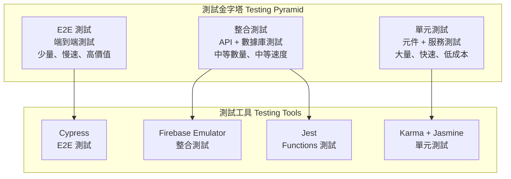

# 測試策略 (Testing Strategy)

> **本專案採用全面的測試金字塔策略**，結合單元測試、整合測試與端到端測試，確保代碼品質與系統穩定性。
> 
> 測試原則：**測試驅動開發、自動化優先、快速反饋、高覆蓋率**。

---

## 🏗️ 測試架構 (Testing Architecture)



---

## 🧪 測試類型與策略 (Test Types & Strategies)

### 1. 單元測試 (Unit Testing)
**目標**: 測試個別元件、服務、管道的功能正確性

```typescript
// user.service.spec.ts
describe('UserService', () => {
  let service: UserService;
  let httpMock: HttpTestingController;
  
  beforeEach(() => {
    TestBed.configureTestingModule({
      imports: [HttpClientTestingModule],
      providers: [UserService]
    });
    
    service = TestBed.inject(UserService);
    httpMock = TestBed.inject(HttpTestingController);
  });
  
  afterEach(() => {
    httpMock.verify();
  });
  
  it('should create user successfully', () => {
    const mockUser: User = {
      id: '1',
      name: 'Test User',
      email: 'test@example.com'
    };
    
    service.createUser(mockUser).subscribe(user => {
      expect(user).toEqual(mockUser);
    });
    
    const req = httpMock.expectOne('/api/users');
    expect(req.request.method).toBe('POST');
    expect(req.request.body).toEqual(mockUser);
    req.flush(mockUser);
  });
});
```

### 2. 整合測試 (Integration Testing)
**目標**: 測試多個元件或服務之間的協作

```typescript
// user-management.integration.spec.ts
describe('User Management Integration', () => {
  let userService: UserService;
  let permissionService: PermissionService;
  
  beforeEach(() => {
    TestBed.configureTestingModule({
      imports: [HttpClientTestingModule],
      providers: [UserService, PermissionService]
    });
    
    userService = TestBed.inject(UserService);
    permissionService = TestBed.inject(PermissionService);
  });
  
  it('should allow admin to create user', async () => {
    // 測試權限檢查與用戶創建的整合
    expect(permissionService.hasPermission(Permission.USER_CREATE)).toBe(true);
    
    const result = await userService.createUser(mockUser).toPromise();
    expect(result).toBeDefined();
  });
});
```

### 3. 端到端測試 (E2E Testing)
```typescript
// cypress/e2e/user-management.cy.ts
describe('User Management E2E', () => {
  beforeEach(() => {
    cy.login('admin@example.com', 'password');
    cy.visit('/users');
  });
  
  it('should create new user', () => {
    cy.get('[data-cy=create-user-btn]').click();
    cy.get('[data-cy=user-name-input]').type('New User');
    cy.get('[data-cy=user-email-input]').type('newuser@example.com');
    cy.get('[data-cy=submit-btn]').click();
    
    cy.get('[data-cy=success-message]').should('contain', '用戶創建成功');
  });
});
```

---

## 🛠️ 測試工具配置 (Testing Tools Configuration)

### Karma + Jasmine 配置
```javascript
// karma.conf.js
module.exports = function (config) {
  config.set({
    frameworks: ['jasmine', '@angular-devkit/build-angular'],
    browsers: ['ChromeHeadless'],
    coverageReporter: {
      dir: require('path').join(__dirname, './coverage/'),
      reporters: [
        { type: 'html' },
        { type: 'text-summary' },
        { type: 'lcov' }
      ],
      check: {
        global: {
          statements: 80,
          branches: 80,
          functions: 80,
          lines: 80
        }
      }
    }
  });
};
```

### Cypress 配置
```typescript
// cypress.config.ts
export default defineConfig({
  e2e: {
    baseUrl: 'http://localhost:4200',
    video: true,
    screenshotOnRunFailure: true,
    defaultCommandTimeout: 10000
  }
});
```

---

## 📊 測試覆蓋率與品質指標 (Coverage & Quality Metrics)

### 覆蓋率目標
- **語句覆蓋率**: > 80%
- **分支覆蓋率**: > 80%
- **函數覆蓋率**: > 80%
- **行覆蓋率**: > 80%

### 品質指標
- **單元測試執行時間**: < 10 秒
- **整合測試執行時間**: < 30 秒
- **E2E 測試執行時間**: < 5 分鐘
- **測試通過率**: > 95%

---

## 🚀 常用測試指令 (Common Testing Commands)

```bash
# 單元測試
ng test                                    # 監聽模式
ng test --no-watch --code-coverage        # 單次執行含覆蓋率
ng test --browsers=ChromeHeadless          # 無頭瀏覽器

# E2E 測試
npm run e2e                               # 完整 E2E 測試
npm run e2e:headless                      # 無頭模式

# Firebase Functions 測試
cd functions && npm test                   # Functions 單元測試
firebase emulators:exec "npm test"        # 使用模擬器測試

# CI/CD 測試
npm run test:ci                           # CI 環境測試
npm run test:coverage                     # 覆蓋率報告
```

---

## 🎯 測試最佳實踐 (Testing Best Practices)

### 測試結構
```typescript
// ✅ 好的測試結構 - AAA 模式
describe('UserService', () => {
  describe('createUser', () => {
    it('should create user with valid data', () => {
      // Arrange - 準備測試數據
      const userData = { name: 'Test', email: 'test@example.com' };
      
      // Act - 執行被測試的操作
      const result = service.createUser(userData);
      
      // Assert - 驗證結果
      expect(result).toBeDefined();
    });
  });
});
```

### 測試數據管理
```typescript
// ✅ 使用測試工廠
class UserTestFactory {
  static create(overrides: Partial<User> = {}): User {
    return {
      id: '1',
      name: 'Test User',
      email: 'test@example.com',
      role: UserRole.USER,
      ...overrides
    };
  }
}
```

---

## 📋 測試檢查清單 (Testing Checklist)

### ✅ 開發階段
- [ ] 每個新功能都有對應測試
- [ ] 測試覆蓋率達到要求
- [ ] 測試命名清楚描述意圖
- [ ] 使用適當的測試工具

### ✅ CI/CD 階段
- [ ] 所有測試在 CI 中通過
- [ ] 測試執行時間在合理範圍
- [ ] 測試結果有適當報告
- [ ] 失敗測試有清楚的錯誤信息

### ✅ 維護階段
- [ ] 定期檢查測試穩定性
- [ ] 更新過時的測試
- [ ] 清理不必要的測試
- [ ] 優化測試執行效率

---

> **核心理念**: 測試是保證代碼品質的重要手段，通過全面的測試策略確保系統的穩定性和可靠性。
> 
> **持續改進**: 定期檢視測試策略，優化測試效率，提升測試品質。
